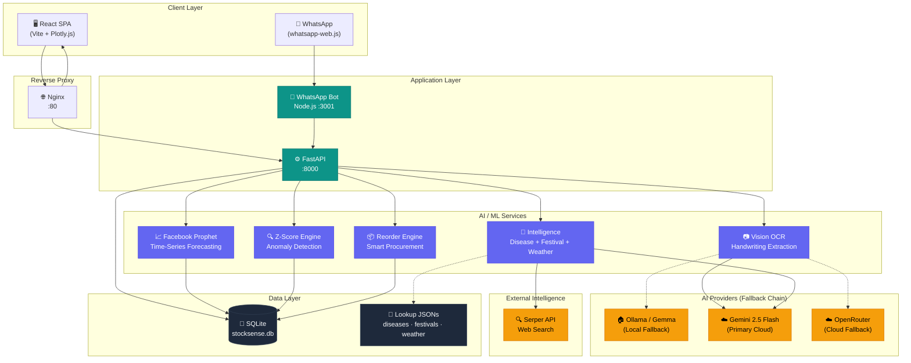
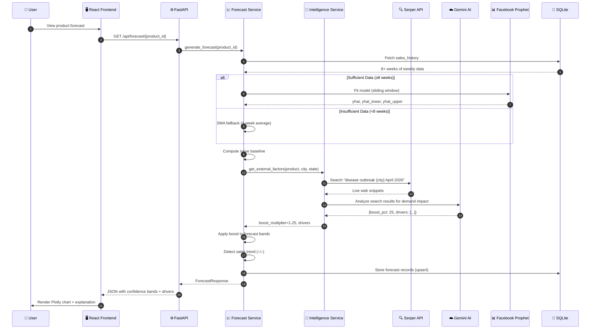
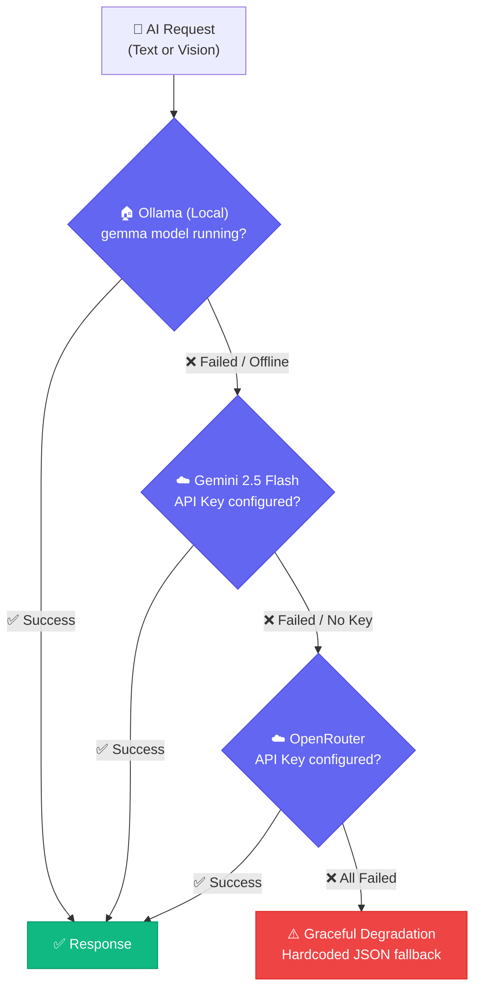
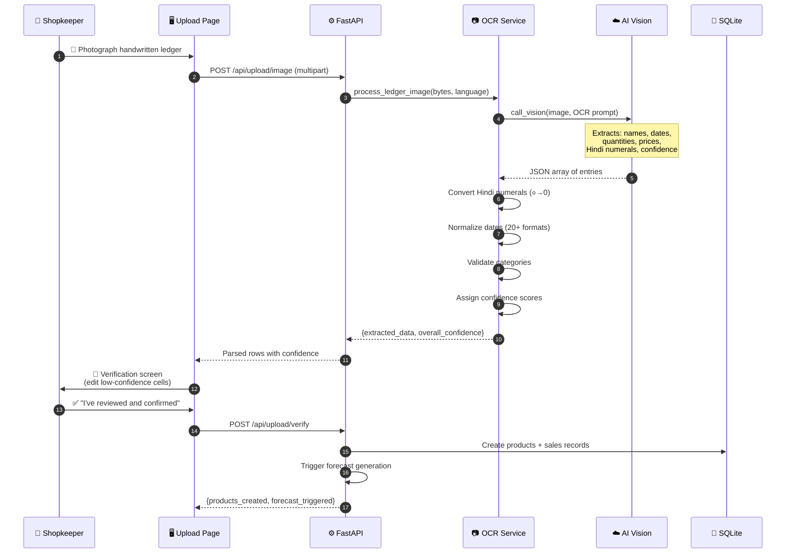

<div align="center">

# 🧠 SupplySense

### AI-Powered Predictive Demand Forecasting & Intelligent Inventory Management

**The forecasting engine that knows about dengue season before your supplier does.**

[](https://natwest.com)
[](https://python.org)
[](https://react.dev)
[](https://fastapi.tiangolo.com)
[](https://facebook.github.io/prophet/)
[](https://docker.com)
[](LICENSE)

<br/>

> **SupplySense doesn't just forecast demand — it understands *why* demand changes.**
> Festival season? Disease outbreak? Monsoon week? Our AI automatically detects real-world signals and adjusts your forecasts before you even notice the trend.

<br/>

[📖 Overview](#-overview) · [✨ Features](#-implemented-features) · [🚀 Quick Start](#-quick-start) · [🛠️ Tech Stack](#️-tech-stack) · [📊 Usage Examples](#-usage-examples) · [🏗️ Architecture](#️-architecture) · [⚠️ Limitations](#️-limitations)

</div>

---

## 📖 Overview

**SupplySense** is a full-stack AI-powered inventory management and demand forecasting platform designed for small and medium businesses in India. It combines **Facebook Prophet** time-series forecasting with **real-world context signals** — disease outbreaks, festival calendars, and monsoon patterns — to produce demand predictions that understand *why* demand changes, not just *that* it changed.

**The problem it solves:** India's 12 million+ small retailers — kirana stores, pharmacies, general shops — manage inventory on gut feel and handwritten ledgers. They have no affordable, accessible tool to anticipate demand shifts from festivals, seasons, or disease outbreaks. This results in ₹1.4 trillion in inventory waste annually: medicines expire on shelves while others run out during peak need.

**Who it's for:** Small business owners (kirana stores, pharmacies, distributors) who need AI-powered forecasting delivered through interfaces they already use — a simple web dashboard and WhatsApp.

---

## 📖 Ramesh's Story

> *Meet **Ramesh**. He runs a small pharmacy in Nagpur. Every evening, he writes the day's sales in a notebook — "Paracetamol 12, ORS 8, Cough Syrup 5." He's done this for 15 years.*
>
> *Last monsoon, dengue hit his area hard. Paracetamol sold out in 2 days. By the time he called his distributor, the entire city was scrambling for stock. He lost ₹15,000 in sales that week alone.*
>
> *This year, Ramesh uses **SupplySense**.*
>
> *He photographs his notebook. AI reads his handwriting — even the Hindi numerals and messy dates. In 60 seconds, his 15 years of paper records become a digital dataset.*
>
> *Three weeks before monsoon peak, SupplySense detects rising dengue reports in Nagpur via live web search. It automatically boosts Paracetamol's forecast by 25%, sends Ramesh a WhatsApp alert in Hindi:*
>
> **"⚠️ डेंगू का मौसम शुरू हो रहा है। पेरासिटामोल का स्टॉक 3 दिन में खत्म हो जाएगा। अभी 200 यूनिट ऑर्डर करें।"**
>
> *This time, Ramesh is ready. He replies "REORDER" on WhatsApp, gets a sorted procurement list grouped by supplier, and places his order — all without opening a single app.*

**That's SupplySense.** From notebook → to dataset → to AI forecast → to WhatsApp alert — in the language you speak, for the reality you live.

---

## ✨ Implemented Features

The following features are **fully implemented and functional** in the current codebase:

### AI & Forecasting
- **Context-aware demand forecasting** — 6-week rolling forecasts using Facebook Prophet with confidence bands (low / likely / high at 80% interval width), with real-world context overlays for festivals, diseases, and weather patterns
- **External factor integration** — Curated lookup tables for 30+ Indian festivals, seasonal disease patterns, and weather heuristics that automatically adjust forecast multipliers
- **AI intelligence pipeline** — 3-stage pipeline: Serper API web search → Gemini AI analysis → boost multiplier calculation; gracefully degrades to hardcoded JSON lookup tables if APIs are unavailable
- **SMA fallback** — Graceful degradation to Simple Moving Average when fewer than 8 weeks of sales history are available
- **Z-score anomaly detection** — Statistical analysis on forecast residuals to catch demand spikes (Z > 2.0), drops (Z < -2.0), and structural pattern shifts (3+ consecutive weeks in same direction), with plain-English explanations
- **Explainable forecasts** — Every prediction includes a human-readable explanation of *why* the forecast looks the way it does (e.g., "Dengue season active in Nagpur → Paracetamol +25%")
- **Smart reorder engine** — AI-calculated reorder quantities ranked by urgency (days-to-stockout), grouped by supplier, with CSV/PDF export
- **3-provider AI fallback chain** — Ollama (local) → Gemini API → OpenRouter, with hardcoded JSON as final fallback if all providers fail
- **Scenario planning** — "What if I run a 20% discount?" / "What if demand grows 15%?" — side-by-side forecast comparison

### Data Ingestion
- **Handwriting OCR** — Photograph a handwritten ledger and Gemini Vision extracts product names, quantities, prices, and dates; handles mixed Hindi/English text and Hindi numerals (१,२,३ → 1,2,3)
- **CSV/Excel upload** — Auto-detects columns and parses sales history; supports bulk import
- **Manual data entry** — Form-based product and sales input
- **Mandatory verification step** — All OCR-extracted and parsed data must be human-reviewed before entering the forecast pipeline (trust layer, not blind automation)

### Frontend (16 Screens)
- **Landing page** with value proposition and CTAs
- **Onboarding flow** — Language selection (English, Hindi), business type, shop setup
- **Dashboard** — Overview KPIs, forecasting charts (Plotly.js), inventory health heatmaps, scenario planning
- **Product catalog** with individual product detail pages and per-product forecasts
- **Upload & verify** pages for CSV and image ingestion
- **Record sales** page with OCR-from-image and CSV upload
- **AI reorder list** with urgency tiers and export
- **Alerts feed** with active and historical alerts
- **Settings** — Profile, notification preferences, language
- **Dark-mode-first UI** with responsive mobile layout

### WhatsApp Bot
- **2-way WhatsApp integration** via whatsapp-web.js (Node.js sidecar)
- **Inbound commands**: `REORDER`, `LIST`, `REPORT`, `STATUS`, `HELP`
- **Outbound notifications**: Stockout alerts, low-stock warnings, daily briefings
- **QR code authentication** — Scan with any WhatsApp account

### Platform
- **JWT authentication** with protected routes
- **RESTful API** with 10 routers and auto-generated Swagger docs at `/docs`
- **Docker Compose** — One-command full-stack launch (backend + frontend + WhatsApp bot + Nginx)
- **Nginx reverse proxy** — Unified access on port 80
- **i18n** — English and Hindi translation files via react-i18next (other languages listed in UI as selectable but only these two have full translation coverage)
- **SQLite database** with SQLAlchemy ORM (PostgreSQL-compatible schema)
- **Seed data script** for demo with pre-populated products and sales history

---

## 🚀 Quick Start

### Prerequisites

- **Docker** and **Docker Compose** installed ([Get Docker](https://docs.docker.com/get-docker/))
- A **Gemini API key** (free — [Get one at AI Studio](https://aistudio.google.com/))
- *(Optional)* [Ollama](https://ollama.com) installed locally for privacy-first local AI inference

### Option 1: Docker Compose (Recommended)

```bash
# 1. Clone the repository
git clone https://github.com/team-zypher/supplysense.git
cd supplysense

# 2. Create your environment file
cp .env.example backend/.env

# 3. Edit backend/.env and add your API key(s)
#    At minimum, set GEMINI_API_KEY:
nano backend/.env
#    → Replace "your-gemini-api-key-here" with your actual key

# 4. Launch the full stack (builds all 4 services)
docker compose up --build

# 5. (First run only) Seed the database with demo data
#    In a new terminal:
docker exec stocksense-backend python seed_data.py
```

Once running, access the application at:

| Service | URL | Description |
|:---|:---|:---|
| 🖥️ **Frontend** | http://localhost:5173 | React web application |
| ⚙️ **Backend API** | http://localhost:8000 | FastAPI REST endpoints |
| 📖 **API Docs** | http://localhost:8000/docs | Interactive Swagger UI |
| 📱 **WhatsApp Bot** | http://localhost:3001 | Bot status & QR code |
| 🌐 **Unified (Nginx)** | http://localhost | All services via reverse proxy |

To stop all services:

```bash
docker compose down
```

### Option 2: Local Development (Without Docker)

```bash
# ── Backend ────────────────────────────────────────────────────
cd backend
python -m venv venv
source venv/bin/activate       # On Windows: venv\Scripts\activate
pip install -r requirements.txt

# Create .env with your API keys (copy from root .env.example)
cp ../.env.example .env
# Edit .env and set GEMINI_API_KEY

# Seed demo data and start the server
python seed_data.py
uvicorn main:app --reload --port 8000

# ── Frontend (new terminal) ───────────────────────────────────
cd frontend
npm install
npm run dev
# → Opens at http://localhost:5173

# ── WhatsApp Bot (new terminal, optional) ─────────────────────
cd whatsapp-bot
npm install
node index.js
# → Runs at http://localhost:3001
# → Scan the QR code in terminal with your WhatsApp app
```

### Environment Variables

Create `backend/.env` using `.env.example` as a template. **Never commit real API keys.**

| Variable | Required | Default | Purpose |
|:---|:---:|:---|:---|
| `GEMINI_API_KEY` | ✅ | — | Primary AI — OCR, forecasting intelligence, NLP |
| `SECRET_KEY` | ✅ | *(preset)* | JWT authentication signing key |
| `DATABASE_URL` | ⬜ | `sqlite:///./data/stocksense.db` | Database connection string |
| `SERPER_API_KEY` | ⬜ | — | Live web search for disease/festival intelligence |
| `OPENROUTER_API_KEY` | ⬜ | — | Cloud AI fallback provider |
| `OLLAMA_BASE_URL` | ⬜ | `http://host.docker.internal:11434` | Local Ollama AI inference |
| `OLLAMA_MODEL` | ⬜ | `gemma3:4b` | Ollama model name |
| `WHATSAPP_BOT_URL` | ⬜ | `http://localhost:3001` | WhatsApp bot sidecar URL |

> 💡 **Minimum setup**: Only `GEMINI_API_KEY` is required. All other services have graceful fallbacks.

---

## 🛠️ Tech Stack

| Layer | Technology | Version | Purpose |
|:---|:---|:---|:---|
| **Forecasting** | Facebook Prophet | ≥1.1.6 | Time-series demand prediction with confidence bands |
| **AI / NLP** | Google Gemini 2.5 Flash | via `google-genai` | OCR, demand factor analysis, forecast explanations |
| **Web Search** | Serper API | REST | Real-time disease/festival/weather signal detection |
| **Anomaly Detection** | NumPy + SciPy | ≥1.26 | Z-score spike/drop/pattern analysis |
| **Backend** | Python + FastAPI | 3.11 / 0.115 | Async REST API with auto-generated Swagger docs |
| **ORM** | SQLAlchemy | 2.0 | Database abstraction (SQLite, PostgreSQL-compatible) |
| **Database** | SQLite | — | Zero-config file-based storage |
| **Frontend** | React + Vite | 19 / 8.0 | Component-based SPA with hot module replacement |
| **Charts** | Plotly.js + react-plotly.js | 3.5 | Interactive forecast charts with confidence bands |
| **Routing** | React Router | 6.30 | Client-side routing with protected routes |
| **i18n** | i18next + react-i18next | 26 / 17 | Multilingual UI (English, Hindi) |
| **WhatsApp** | whatsapp-web.js + Express | 1.26 / 4.21 | Node.js sidecar for 2-way WhatsApp messaging |
| **PDF Export** | ReportLab | 4.2 | Reorder list PDF generation |
| **Auth** | python-jose + passlib | — | JWT token-based authentication |
| **Deployment** | Docker Compose + Nginx | — | One-command full-stack containerised launch |

### Why These Choices

- **Prophet over ARIMA/LSTM**: Prophet handles missing data, holiday effects, and changepoints natively — ideal for messy small-business sales data with irregular gaps.
- **Gemini over GPT**: Free 1M tokens/day tier, native multimodal vision for OCR, and multilingual generation in Indian languages without fine-tuning.
- **SQLite over PostgreSQL**: Zero-config for hackathon demos; the SQLAlchemy ORM makes it one config change to switch to PostgreSQL in production.
- **whatsapp-web.js over Business API**: Free, no business verification needed, and scan-to-connect in seconds — ideal for hackathon demos.

---

## 📊 Usage Examples

### Screenshots and Screen Recordings


https://github.com/user-attachments/assets/3b9db9c2-6288-4d41-a932-5d6555d11b04


https://github.com/user-attachments/assets/9b176a24-03f8-416d-b1c8-35b35fc12d24


### Demo Login

After seeding the database, log in with the pre-configured demo account:

```
Shop Name: Ramesh Medical Store
City:      Nagpur
State:     Maharashtra
```

### API Examples

All API endpoints are documented at `http://localhost:8000/docs` (Swagger UI). Here are key examples:

#### 1. Get Forecast for a Product

```bash
curl http://localhost:8000/api/forecast/1
```

**Sample Response:**

```json
{
  "product_id": 1,
  "product_name": "Paracetamol 500mg",
  "method": "prophet",
  "forecast": [
    { "week": "2026-W16", "low": 60, "likely": 85, "high": 120 },
    { "week": "2026-W17", "low": 65, "likely": 92, "high": 130 },
    { "week": "2026-W18", "low": 70, "likely": 98, "high": 140 }
  ],
  "baseline": [
    { "week": "2026-W16", "value": 75 }
  ],
  "drivers": "Dengue season active in Maharashtra (Jul–Oct). Forecast boosted +25%.",
  "trend": "upward",
  "trend_pct": 8.5,
  "accuracy": { "mape": 11.2 }
}
```

#### 2. Upload an Image for OCR

```bash
curl -X POST http://localhost:8000/api/upload/image \
  -F "file=@notebook_photo.jpg" \
  -F "language=hi"
```

**Sample Response:**

```json
{
  "extracted_data": [
    {
      "product_name": "Paracetamol",
      "quantity": 12,
      "price": 45.0,
      "date": "2026-04-10",
      "confidence": 0.92
    },
    {
      "product_name": "ORS Sachets",
      "quantity": 8,
      "price": 25.0,
      "date": "2026-04-10",
      "confidence": 0.87
    }
  ],
  "overall_confidence": 0.89,
  "needs_verification": true
}
```

#### 3. Get Anomaly Alerts

```bash
curl http://localhost:8000/api/anomalies
```

**Sample Response:**

```json
{
  "anomalies": [
    {
      "product_id": 1,
      "product_name": "Paracetamol 500mg",
      "type": "spike",
      "z_score": 2.8,
      "severity": "high",
      "explanation": "Demand is 3× normal this week — possible local illness outbreak.",
      "recommendation": "Consider emergency reorder of 200 units."
    }
  ]
}
```

#### 4. Get AI Reorder List

```bash
curl http://localhost:8000/api/reorder
```

#### 5. Export Reorder as CSV

```bash
curl http://localhost:8000/api/reorder/export?format=csv -o reorder_list.csv
```

#### 6. Check AI Provider Status

```bash
curl http://localhost:8000/api/ai-status
```

**Sample Response:**

```json
{
  "primary": { "provider": "ollama", "status": "available", "model": "gemma3:4b" },
  "fallback_1": { "provider": "gemini", "status": "available" },
  "fallback_2": { "provider": "openrouter", "status": "not_configured" }
}
```

### WhatsApp Bot Commands

Once the WhatsApp bot is connected (scan QR code at startup):

| You Send | Bot Responds With |
|:---|:---|
| `REORDER` | Full AI reorder list with quantities, suppliers, urgency tiers |
| `LIST` | Top 5 low-stock items with days-to-stockout |
| `REPORT` | Weekly performance summary with forecast accuracy |
| `STATUS` | System health check and stock overview |
| `HELP` | All available commands |

---

## 🏗️ Architecture

### High-Level System Design



### Folder Structure

```
supplysense/
├── README.md                     # This file
├── .env.example                  # Environment variable template (no secrets)
├── docker-compose.yml            # Development orchestration (4 services)
├── docker-compose.prod.yml       # Production build variant
├── nginx/
│   └── nginx.conf                # Reverse proxy configuration
│
├── backend/                      # Python FastAPI backend
│   ├── main.py                   # Application entry point + lifespan
│   ├── config.py                 # Pydantic-based settings from env vars
│   ├── database.py               # SQLAlchemy engine + session factory
│   ├── seed_data.py              # Demo data seeder (products + sales)
│   ├── requirements.txt          # Python dependencies
│   ├── Dockerfile                # Backend container image
│   ├── routers/                  # API endpoint handlers
│   │   ├── auth.py               #   JWT login/register
│   │   ├── inventory.py          #   Product CRUD + stock management
│   │   ├── upload.py             #   CSV/image upload + OCR
│   │   ├── forecast.py           #   Forecast generation + retrieval
│   │   ├── anomalies.py          #   Anomaly detection endpoints
│   │   ├── reorder.py            #   Smart reorder list + export
│   │   ├── alerts.py             #   Alert feed management
│   │   ├── sales.py              #   Sales recording
│   │   ├── settings.py           #   User preferences
│   │   └── whatsapp.py           #   WhatsApp webhook + bot control
│   ├── models/                   # SQLAlchemy ORM models
│   │   ├── user.py               #   User / shop profile
│   │   ├── product.py            #   Product catalog + inventory
│   │   ├── sales.py              #   Sales history records
│   │   ├── forecast.py           #   Stored forecast data
│   │   ├── anomaly.py            #   Detected anomaly records
│   │   ├── alert.py              #   Alert notifications
│   │   └── ...                   #   Stock movements, notifications, etc.
│   ├── schemas/                  # Pydantic request/response schemas
│   │   ├── inventory.py          #   Product + stock schemas
│   │   ├── forecast.py           #   Forecast response schemas
│   │   ├── upload.py             #   OCR/CSV upload schemas
│   │   └── ...                   #   Auth, sales, settings, etc.
│   ├── services/                 # AI/ML business logic
│   │   ├── ai_client.py          #   3-provider fallback AI client
│   │   ├── forecast_service.py   #   Prophet-based forecasting engine
│   │   ├── anomaly_service.py    #   Z-score anomaly detection
│   │   ├── intelligence_service.py # Disease/festival/weather signals
│   │   ├── ocr_service.py        #   Handwriting OCR via vision AI
│   │   ├── reorder_service.py    #   Smart reorder calculations
│   │   ├── embedding_service.py  #   Product similarity embeddings
│   │   └── lookup_data/          #   Curated intelligence datasets
│   │       ├── disease_seasons.json
│   │       ├── festival_calendar.json
│   │       └── weather_heuristics.json
│   └── utils/                    # Shared utilities
│       ├── auth.py               #   JWT token helpers
│       ├── csv_parser.py         #   CSV column detection + parsing
│       └── pdf_generator.py      #   ReportLab PDF export
│
├── frontend/                     # React 19 + Vite SPA
│   ├── index.html                # HTML entry point
│   ├── package.json              # Node.js dependencies
│   ├── vite.config.js            # Vite dev server + proxy config
│   ├── Dockerfile                # Frontend container image
│   └── src/
│       ├── App.jsx               # Router + protected routes
│       ├── main.jsx              # React DOM entry point
│       ├── components/           # Shared UI components
│       │   ├── Layout/           #   Sidebar + top nav layout
│       │   └── PlotChart.jsx     #   Reusable Plotly chart wrapper
│       ├── pages/                # 16 page components
│       │   ├── Landing.jsx       #   Public landing page
│       │   ├── Login.jsx         #   Authentication
│       │   ├── onboarding/       #   3-step onboarding flow
│       │   ├── dashboard/        #   Overview, Forecasting, Inventory, Scenarios
│       │   ├── products/         #   Catalog + detail pages
│       │   ├── upload/           #   Upload + verification pages
│       │   ├── sales/            #   RecordSales (OCR + CSV)
│       │   ├── Reorder.jsx       #   AI reorder list
│       │   ├── Alerts.jsx        #   Alert feed
│       │   └── Settings.jsx      #   User preferences
│       ├── services/
│       │   └── api.js            # API client with error handling
│       ├── hooks/
│       │   └── useApi.js         # Custom fetch hook with loading/error states
│       ├── i18n/                 # Internationalization
│       │   ├── index.js          #   i18next config
│       │   └── locales/
│       │       ├── en.json       #   English translations
│       │       └── hi.json       #   Hindi translations
│       └── styles/               # CSS design system
│           ├── index.css         #   Global styles + CSS variables
│           ├── layout.css        #   Layout + responsive grid
│           └── components.css    #   Component-level styles
│
├── whatsapp-bot/                 # Node.js WhatsApp sidecar
│   ├── index.js                  # Express server + bot lifecycle
│   ├── whatsapp-client.js        # whatsapp-web.js wrapper
│   ├── message-handler.js        # Inbound command routing
│   ├── message-templates.js      # Outbound message formatters
│   ├── config.js                 # Bot configuration
│   ├── package.json              # Node.js dependencies
│   └── Dockerfile                # Bot container (with Chromium)
│
├── shared/                       # Cross-service contracts (read-only)
│   ├── api-contracts.md          # API endpoint specifications
│   ├── schema.sql                # Database DDL
│   └── design-tokens.css         # CSS variables / design system
│
├── docs/                         # Architecture documentation
│   ├── HLD.md                    # High-level design document
│   ├── HLD_mermaid.md            # Architecture diagrams (Mermaid)
│   ├── sequence_diagrams.md      # Interaction sequence diagrams
│   └── sequence_diagrams_mermaid.md
│
└── data/                         # Sample datasets
    ├── sales_8weeks.csv          # 8-week sales history (demo data)
    └── inventory.png             # Sample handwritten ledger image
```

### AI Forecasting Pipeline



### AI Provider Fallback Chain



### OCR Data Ingestion Pipeline



---

## ⚠️ Limitations

The following are honest descriptions of what is **not fully implemented** or has **known constraints**:

| Area | Limitation |
|:---|:---|
| **i18n coverage** | The UI offers 7 language options (Hindi, Tamil, Telugu, Marathi, Bengali, Gujarati), but only English and Hindi have complete translation files. Selecting other languages currently falls back to English. |
| **WhatsApp bot pairing** | Uses `whatsapp-web.js` which requires a running Chromium instance; the session may disconnect if the Docker container restarts. The QR code must be re-scanned after session expiry. |
| **Forecast accuracy tracking** | MAPE is computed when sufficient history exists, but the "predicted vs actual" overlay chart on the forecasting page uses calculated data rather than stored historical predictions. |
| **Multi-user support** | The system is designed for single-tenant use (one shop per instance). Multi-user role-based access is not implemented. |
| **Email notifications** | The settings page shows email notification preferences, but email delivery is not wired up — WhatsApp and in-app alerts are the only active channels. |
| **Expiry date tracking** | Products support an `expiry_date` field in the database, but the expiry timeline calendar view is not yet connected to live data. |
| **Test coverage** | The project does not currently include automated unit or integration tests. |
| **Production deployment** | The application runs locally via Docker Compose. It has not been deployed to a cloud hosting provider. |

---

## 🔮 Future Improvements

With more time, we would prioritise:

1. **Complete multilingual coverage** — Full translation files for Tamil, Telugu, Marathi, Bengali, and Gujarati
2. **Automated test suite** — pytest for backend services (especially forecast and anomaly logic), React Testing Library for frontend components
3. **Multi-tenant architecture** — Role-based access for shop owners, distributors, and staff
4. **PostgreSQL migration** — For production scalability (schema is already ORM-compatible)
5. **Scheduled forecast refresh** — Background job (via APScheduler or Celery) to auto-regenerate forecasts nightly
6. **WhatsApp Business API** — Replace whatsapp-web.js with the official Meta Business API for production reliability
7. **Historical prediction tracking** — Store each generated forecast snapshot to compute true MAPE over time
8. **Cloud deployment** — Docker-based deployment to AWS/GCP with CI/CD pipeline
9. **Barcode scanning** — Camera-based product identification for faster stock updates
10. **Supplier portal** — Direct integration for automatic order placement

---

## 🏆 Hackathon Criteria Alignment

| NatWest Criteria | SupplySense Implementation |
|:---|:---|
| **AI-powered forecasting** | Prophet + external factor overlays (disease, festival, weather) |
| **Uncertainty quantification** | Confidence bands (low/likely/high) with 80% interval |
| **Anomaly detection** | Z-score analysis on forecast residuals (spike/drop/pattern) |
| **Baseline comparison** | Naive "same as last period" dotted line overlay |
| **Explainability** | Plain-language driver text: "Dengue season active (+25%)" |
| **Non-expert usability** | WhatsApp-first, multilingual, mobile-first dark UI |
| **Real-world applicability** | Designed for 12M+ Indian small businesses |
| **Technical innovation** | Handwriting OCR + disease intelligence + WhatsApp integration |

---

## 👥 Target Users

| Persona | Business | Pain Point | SupplySense Solution |
|:---|:---|:---|:---|
| 🏪 **Ramesh** | Kirana Store, Nagpur | Tracks 200 SKUs in a notebook | OCR → instant digital inventory |
| 🏥 **Dr. Priya** | Pharmacy, Chennai | Misses dengue-season medicine spikes | Disease intelligence auto-boosts forecasts |
| 📦 **Vikram** | Distributor, Delhi | Manages 50+ retailer orders | WhatsApp briefings + bulk reorder exports |

---

## 📜 License

This project is licensed under the **Apache License 2.0**. See [LICENSE](LICENSE) for details.

All commits are signed off in compliance with the **Developer Certificate of Origin (DCO)**.

---

<div align="center">

### Team Zypher

| Role | Name |
|:---|:---|
| 💻 **Team Leader** | Ayush Kumar |
| 💻 **Member** | Arnav Kumar |
| 💻 **Member** | Yash Agarwal |
| 💻 **Member** | Gaurav Kumar |

**SupplySense** — *"From notebook to forecast in 60 seconds."*
---
[](https://natwest.com)

</div>
