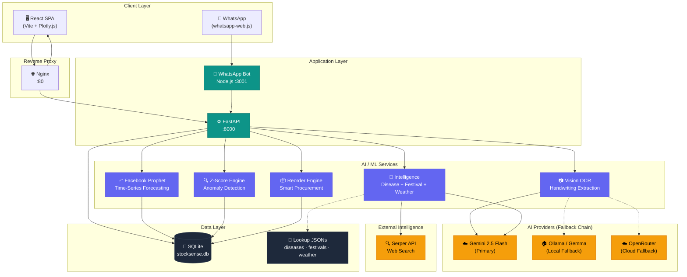
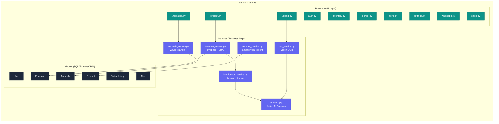
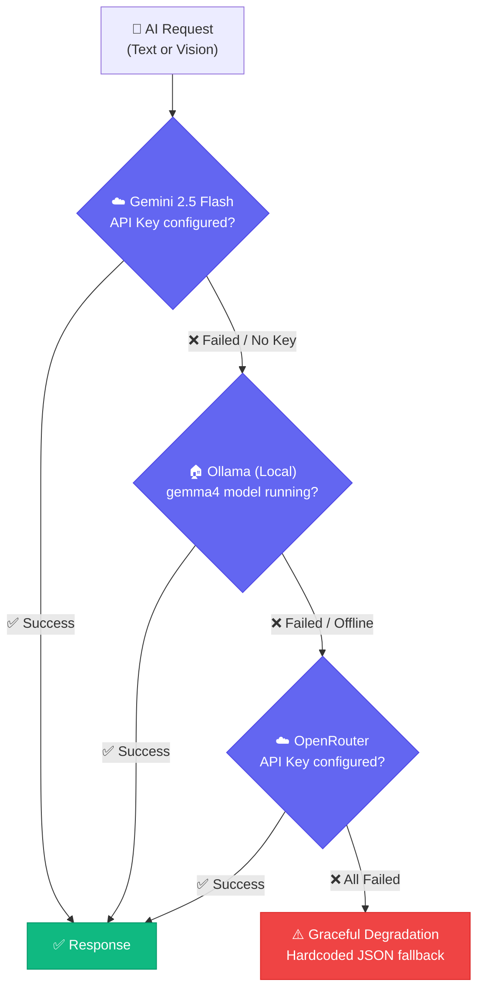
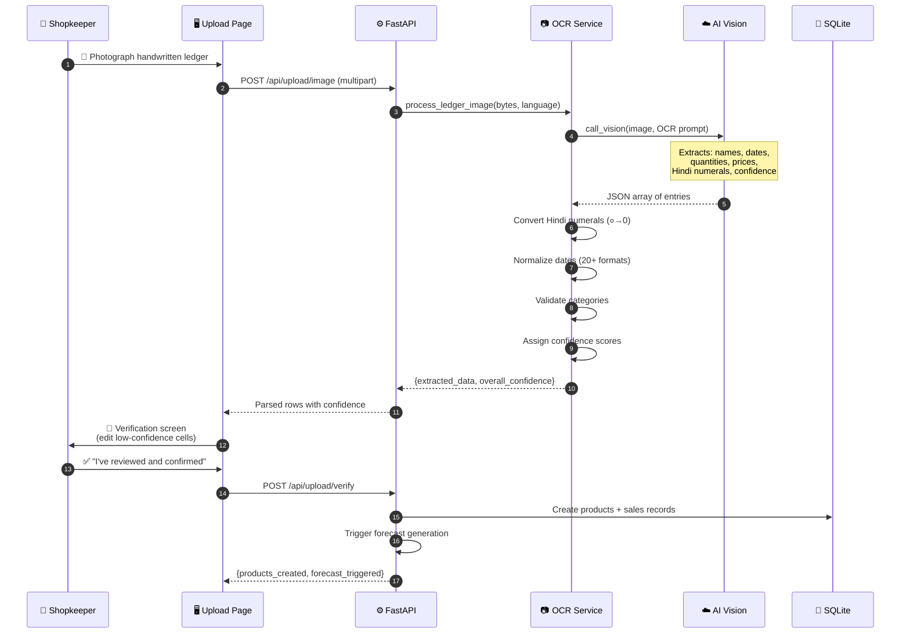
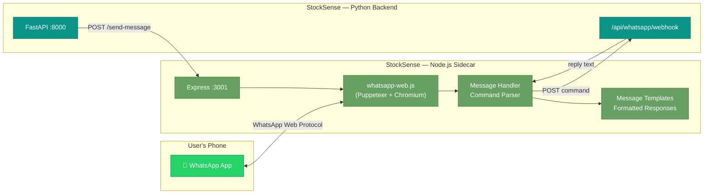
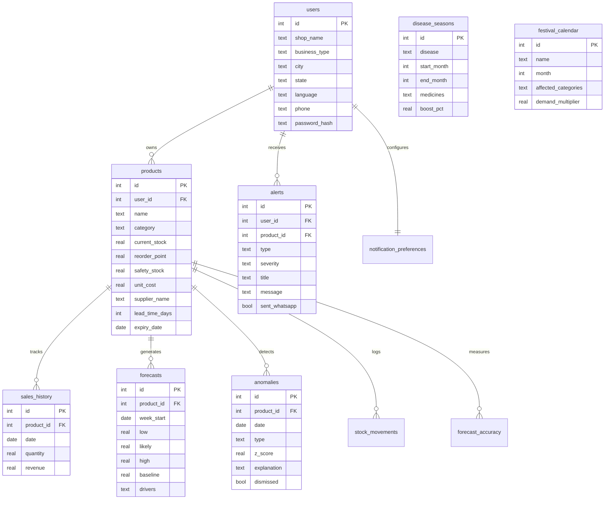

<div align="center">

# 🧠 StockSense

### AI-Powered Inventory Management & Demand Forecasting

**From notebook to forecast in 60 seconds.**

[](https://natwest.com)
[](https://python.org)
[](https://react.dev)
[](https://fastapi.tiangolo.com)
[](https://facebook.github.io/prophet/)
[](https://docker.com)
[](LICENSE)

<br/>

> **60% of India's 12M+ kirana stores still track inventory on paper notebooks.**
> StockSense bridges the gap between handwritten ledgers and AI-powered demand intelligence — via the interface they already use every day: **WhatsApp**.

<br/>

[🚀 Quick Start](#-quick-start) · [✨ Features](#-features) · [🏗️ Architecture](#️-system-architecture) · [📊 AI Pipeline](#-ai--ml-pipeline) · [📱 WhatsApp Bot](#-whatsapp-first-interface) · [🎨 Design](#-design-system) · [📖 API Reference](#-api-reference)

</div>

---

## 🎯 The Problem

Small Indian businesses — pharmacies, kirana stores, distributors — face a brutal reality:

| Pain Point | Impact |
|:---|:---|
| 📓 **Paper-based tracking** | No visibility into stock levels until it's too late |
| 📉 **Stockouts during disease outbreaks** | Lost revenue during peak demand (dengue, monsoon) |
| 🔮 **Zero demand forecasting** | Over-ordering perishables → waste; under-ordering essentials → lost sales |
| 💬 **No proactive alerts** | Owner discovers stockout when customer walks away empty-handed |
| 🌐 **Language barriers** | Most tools are English-only; shopkeepers need Hindi, Tamil, Telugu |

**StockSense solves all of this** — with AI that speaks your language, reads your handwriting, and alerts you via WhatsApp before problems happen.

---

## 🏆 Key Differentiators

<div align="center">

| | Feature | Description |
|:---:|:---|:---|
| 📷 | **Handwriting OCR** | Photograph your ledger → AI extracts product data in Hindi/English/Tamil |
| 🦠 | **Disease Intelligence** | Real-time outbreak tracking → auto-boost medicine forecasts |
| 📱 | **WhatsApp-First** | Daily briefings, reorder commands, alerts — no app install needed |
| 🎯 | **Explainable AI** | "Paracetamol demand +25% because dengue season is active" |
| 🆓 | **100% Free Stack** | Prophet + Gemini Flash + SQLite — ₹0 infrastructure cost |
| 🌍 | **7 Indian Languages** | English, हिंदी, தமிழ், తెలుగు, मराठी, বাংলা, ગુજરાતી |

</div>

---

## ✨ Features

### 📷 Handwriting OCR — "Notebook to Database in 60 Seconds"
Upload a photo of your handwritten sales register. StockSense's AI vision pipeline:
- Reads **mixed Hindi/English** text using Gemini 2.5 Flash multimodal
- Converts **Hindi numerals** (१, २, ३ → 1, 2, 3) and number words (बारह → 12)
- Parses **20+ date formats** (12 Jan, 12/3, १२-०३-२०२६)
- Assigns **per-cell confidence scores** (0.0–1.0)
- Routes through a mandatory **verification step** before any data enters the forecast engine

### 📈 Prophet-Powered Demand Forecasting
6-week rolling demand forecasts using Facebook Prophet with external factor overlays:
- **Confidence bands** (low / likely / high) with 80% interval width
- **Baseline comparison** — naive "same as last period" dotted line
- **Sliding window training** — last 8 weeks for fresh, responsive models
- **SMA fallback** — Simple Moving Average when < 8 weeks of data
- **Scenario planning** — "What if I run a 20% discount?" / "What if supplier delays 5 days?"

### 🦠 Real-Time Disease Intelligence
A 3-stage intelligence pipeline powers context-aware forecasts:
1. **Serper Web Search** → live disease outbreak data for your city/state
2. **Gemini Analysis** → structured demand impact assessment
3. **Hardcoded Fallback** → curated JSON lookup tables (disease seasons, festivals, weather)

Covered signals: **dengue, malaria, monsoon flu, Diwali/Holi buying patterns, heat waves, cold waves**

### 🔍 Z-Score Anomaly Detection
Statistical anomaly detection on forecast residuals:
- **Spike detection**: Z > 2.0 → "Demand is 3× normal this week — possible outbreak"
- **Drop detection**: Z < -2.0 → "Sales dropped 40% — check competitor pricing"
- **Pattern detection**: 3+ consecutive weeks of same-direction deviation → structural shift alert
- Plain-language explanations generated per anomaly

### 📦 Smart Reorder Engine
AI-calculated reorder lists ranked by urgency:
```
reorder_qty = (forecast_demand × lead_time_days) + safety_stock − current_stock
```
- **Urgency tiers**: 🔴 High (< 3 days) · 🟡 Medium (3–7 days) · 🟢 Low (7+ days)
- **Supplier grouping**: Orders batched by supplier for efficient procurement
- **Export**: CSV and PDF download for WhatsApp/email forwarding
- **Days-to-stockout**: Real-time countdown per product

### 📱 WhatsApp-First Interface
Zero-install voice of the system — daily briefings and two-way commands:

| Command | Response |
|:---|:---|
| *(automatic 8 AM)* | 📊 Daily briefing: stock health, top alerts, reorder reminders |
| `REORDER` | 📦 Full reorder list with quantities, suppliers, urgency |
| `LIST` | 📋 Top 5 low-stock items with days remaining |
| `REPORT` | 📈 Weekly performance summary |
| `STATUS` | 🔄 Connection and system health check |
| `HELP` | 📖 List all available commands |

### 🌐 Multilingual Support
Full i18n with `react-i18next` across all 16 screens:
- **7 languages**: English, Hindi, Tamil, Telugu, Marathi, Bengali, Gujarati
- **Bilingual onboarding**: Language selection with native script display
- **OCR language hints**: AI adapts extraction based on user's language preference

---

## 🏗️ System Architecture

### High-Level Design



### Logical Architecture — Modular Monolith



---

## 📊 AI / ML Pipeline

### Forecast Generation Flow


### AI Provider Fallback Chain



### OCR Data Ingestion Pipeline



---

## 📱 WhatsApp-First Interface

### Architecture



### Supported Commands

| Command | Description | Example Response |
|:---|:---|:---|
| `REORDER` | Full AI reorder list | 📦 **Reorder List (8 items)**<br/>1. Paracetamol — 200 units (🔴 HIGH)<br/>2. ORS Sachets — 150 units (🟡 MED) |
| `LIST` | Top 5 low-stock items | 📋 **Low Stock Alert**<br/>⚠️ Paracetamol: 15 left (1.5 days) |
| `REPORT` | Weekly performance | 📊 **Weekly Report**<br/>Sales: ₹24,500 · Accuracy: 89% |
| `FULL` | Detailed report | Extended version with charts |
| `STATUS` | System health | ✅ All systems operational |
| `STOP` | Pause notifications | 🔕 Notifications paused |
| `HELP` | Command reference | 📖 Available commands list |

---

## 🎨 Design System

### Brand Identity

| Token | Value | Usage |
|:---|:---|:---|
| **Primary** | `#0D9488` → `#10B981` | CTAs, active states, healthy stock |
| **Warning** | `#F59E0B` (Amber) | Low stock, approaching reorder |
| **Danger** | `#EF4444` (Red) | Critical alerts, stockouts, expiry |
| **Info** | `#3B82F6` (Blue) | Informational badges, tips |
| **Background** | `#0F172A` → `#1E293B` | Dark mode default (deep navy) |
| **Surface** | `rgba(255,255,255,0.05)` | Glassmorphism cards |
| **Typography** | Inter (Google Fonts) | Clean, modern, highly legible |
| **Border Radius** | `12px` cards · `8px` inputs · `24px` buttons | Rounded, friendly aesthetic |

### Design Principles

| Principle | Implementation |
|:---|:---|
| **Mobile-first** | Every screen designed at 360px first, scales up |
| **Minimal cognitive load** | Max 3 actions per screen, plain language |
| **Visual-first** | Charts, color-coding, icons over text tables |
| **Dark mode default** | Deep navy background with high-contrast text |
| **Accessibility** | WCAG 2.1 AA, 44px touch targets, high contrast |

### Screen Inventory — 16 Screens

| # | Screen | Route | Purpose |
|:---:|:---|:---|:---|
| 1 | Landing Page | `/` | Hero, value prop, CTAs |
| 2 | Language Selection | `/onboarding/language` | Choose from 7 languages |
| 3 | Business Type | `/onboarding/business-type` | Pharmacy / Kirana / Retail / Other |
| 4 | Shop Setup | `/onboarding/setup` | Name, city, state, phone |
| 5 | Data Upload | `/upload` | CSV / Image / Manual entry |
| 6 | Data Verification | `/upload/verify` | OCR trust layer — edit & confirm |
| 7 | Overview Dashboard | `/dashboard/overview` | KPIs, health donut, alert feed |
| 8 | Forecasting Dashboard | `/dashboard/forecasting` | Per-product forecast with confidence bands |
| 9 | Inventory Health | `/dashboard/inventory` | Heatmap, expiry timeline, slow-movers |
| 10 | Scenario Planning | `/dashboard/scenarios` | What-if simulations (discount, surge, delay) |
| 11 | Product Catalog | `/products` | Full inventory listing with filters |
| 12 | Product Detail | `/products/:id` | Single product deep-dive + forecast |
| 13 | Smart Reorder | `/reorder` | AI reorder list grouped by supplier |
| 14 | Alert Center | `/alerts` | Severity-filtered active alerts |
| 15 | Settings | `/settings` | Profile, notifications, WhatsApp |
| 16 | WhatsApp Demo | *(mobile mockup)* | Bot interaction showcase |

---

## 🗄️ Database Schema



---

## 🛠️ Tech Stack

<div align="center">

| Layer | Technology | Purpose |
|:---|:---|:---|
| **Frontend** | React 18 + Vite | SPA with HMR, fast builds |
| **Charts** | Plotly.js / react-plotly.js | Interactive forecast visualization |
| **i18n** | react-i18next | 7-language multilingual support |
| **Routing** | react-router-dom v6 | Client-side navigation |
| **Backend** | FastAPI (Python 3.11) | Async REST API with auto-docs |
| **ORM** | SQLAlchemy 2.0 | Database models + migrations |
| **Validation** | Pydantic v2 | Request/response schema validation |
| **Auth** | python-jose + passlib | JWT tokens + bcrypt password hashing |
| **Forecasting** | Facebook Prophet | Time-series demand prediction |
| **Intelligence** | Google Gemini 2.5 Flash | OCR, NLP analysis, demand factors |
| **Web Search** | Serper API | Real-time disease/festival/weather data |
| **Anomaly Detection** | NumPy / SciPy (Z-score) | Statistical outlier detection |
| **WhatsApp** | whatsapp-web.js + Express | Node.js sidecar for messaging |
| **Database** | SQLite (dev) / PostgreSQL (prod) | Zero-config local, scalable cloud |
| **Reverse Proxy** | Nginx | Unified access on port 80 |
| **Containerization** | Docker Compose | One-command deployment |
| **Local AI** | Ollama (Gemma 4) | Privacy-first local inference fallback |

</div>

---

## 🚀 Quick Start

### Prerequisites

| Tool | Version | Check |
|:---|:---|:---|
| Docker & Docker Compose | v24+ | `docker --version` |
| Node.js *(optional, for local dev)* | v18+ | `node --version` |
| Python *(optional, for local dev)* | 3.11+ | `python3 --version` |

### Option 1: Docker Compose (Recommended)

```bash
# 1. Clone the repository
git clone https://github.com/your-org/stocksense.git
cd stocksense

# 2. Configure environment
cp .env.example backend/.env
# Edit backend/.env with your API keys (see below)

# 3. Launch everything
chmod +x start.sh
./start.sh
```

**That's it.** Access the app:

| Service | URL |
|:---|:---|
| 🖥️ Frontend | http://localhost:5173 |
| ⚙️ Backend API | http://localhost:8000 |
| 📖 API Docs (Swagger) | http://localhost:8000/docs |
| 📱 WhatsApp Bot | http://localhost:3001 |
| 🌐 Unified (Nginx) | http://localhost:80 |

### Option 2: Local Development

```bash
# Backend
cd backend
python -m venv venv
source venv/bin/activate
pip install -r requirements.txt
python seed_data.py          # Seed demo data
uvicorn main:app --reload --port 8000

# Frontend (separate terminal)
cd frontend
npm install
npm run dev                  # → http://localhost:5173

# WhatsApp Bot (separate terminal)
cd whatsapp-bot
npm install
node index.js                # → http://localhost:3001
```

### Environment Variables

```bash
# ─── Required ──────────────────────────────────────────────
GEMINI_API_KEY=your-gemini-api-key      # Primary AI (free: aistudio.google.com)
SECRET_KEY=your-jwt-secret              # JWT signing key

# ─── Optional — Enhanced Intelligence ─────────────────────
SERPER_API_KEY=your-serper-key          # Web search for live disease data
OPENROUTER_API_KEY=your-openrouter-key  # Cloud AI fallback

# ─── Optional — Local AI ──────────────────────────────────
OLLAMA_BASE_URL=http://localhost:11434  # Local Ollama instance
OLLAMA_MODEL=gemma4:latest             # Model for local inference
```

> **💡 Minimum viable setup**: Only `GEMINI_API_KEY` is required. Everything else has sensible defaults or graceful fallbacks.

---

## 📖 API Reference

### Authentication

| Method | Endpoint | Description |
|:---|:---|:---|
| `POST` | `/api/auth/register` | Create account (shop_name, business_type, phone, password) |
| `POST` | `/api/auth/login` | Login → JWT token |

### Data Ingestion

| Method | Endpoint | Description |
|:---|:---|:---|
| `POST` | `/api/upload/csv` | Upload CSV/Excel sales data |
| `POST` | `/api/upload/image` | Upload ledger photo → OCR extraction |
| `POST` | `/api/upload/verify` | Confirm verified data → trigger forecast |

### Inventory

| Method | Endpoint | Description |
|:---|:---|:---|
| `GET` | `/api/inventory` | List products (filter by category, status) |
| `GET` | `/api/inventory/:id` | Single product details |
| `POST` | `/api/inventory` | Create product |
| `PUT` | `/api/inventory/:id` | Update stock + record movement |
| `GET` | `/api/inventory/health` | Health summary (total SKUs, below reorder, stockout risk) |
| `GET` | `/api/inventory/expiring?days=7` | Products expiring within N days |

### Forecasting

| Method | Endpoint | Description |
|:---|:---|:---|
| `GET` | `/api/forecast/:product_id` | 6-week forecast with confidence bands + drivers |
| `GET` | `/api/forecast/all` | Summary for all products |
| `POST` | `/api/forecast/scenario` | What-if simulation (discount, surge, delay) |

### Anomalies & Alerts

| Method | Endpoint | Description |
|:---|:---|:---|
| `GET` | `/api/anomalies` | Active anomalies (filter by severity) |
| `GET` | `/api/alerts` | Alert feed (critical/warning/info) |
| `PUT` | `/api/alerts/:id/dismiss` | Dismiss an alert |

### Reorder

| Method | Endpoint | Description |
|:---|:---|:---|
| `GET` | `/api/reorder` | AI reorder list (ranked by urgency, grouped by supplier) |
| `GET` | `/api/reorder/export?format=csv` | Export as CSV |
| `GET` | `/api/reorder/export?format=pdf` | Export as PDF |

### System

| Method | Endpoint | Description |
|:---|:---|:---|
| `GET` | `/api/health` | Backend health check |
| `GET` | `/api/ai-status` | AI provider availability (Gemini/Ollama/OpenRouter) |

> 📖 **Full interactive docs**: Visit `http://localhost:8000/docs` for Swagger UI with request/response schemas.

---

## 📁 Project Structure

```
stocksense/
├── 📄 AGENTS.md                   # Multi-agent coordination protocol
├── 📄 PRD.md                      # Product requirements document
├── 📄 docker-compose.yml          # One-command deployment
├── 📄 start.sh                    # Launch script
├── 📄 .env.example                # Environment variable template
│
├── 📁 docs/                       # Architecture documentation
│   ├── HLD.md                     # High-level design document
│   ├── HLD_mermaid.md             # Mermaid architecture diagrams
│   ├── sequence_diagrams.md       # Interaction flow specs
│   └── sequence_diagrams_mermaid.md
│
├── 📁 design/                     # UI/UX specifications
│   ├── DESIGN_DOC.md              # 16-screen design document
│   └── screens/                   # PNG mockups (16 screens)
│
├── 📁 shared/                     # Cross-agent contracts
│   ├── api-contracts.md           # REST API specifications
│   ├── schema.sql                 # Database DDL
│   └── design-tokens.css          # CSS custom properties
│
├── 📁 data/                       # Sample datasets
│   ├── sales_8weeks.csv           # 8-week sales history (pharmacy)
│   └── inventory.png              # Sample handwritten ledger
│
├── 📁 backend/                    # ⚙️ Python FastAPI
│   ├── main.py                    # App entry point + CORS + routers
│   ├── config.py                  # Environment configuration
│   ├── database.py                # SQLAlchemy engine + sessions
│   ├── seed_data.py               # Demo data seeder
│   ├── Dockerfile
│   ├── requirements.txt
│   ├── routers/                   # API endpoint handlers
│   │   ├── auth.py                # JWT authentication
│   │   ├── upload.py              # CSV + OCR upload
│   │   ├── inventory.py           # CRUD + health + expiry
│   │   ├── forecast.py            # Prophet forecasting
│   │   ├── anomalies.py           # Z-score detection
│   │   ├── reorder.py             # Smart procurement
│   │   ├── alerts.py              # Alert management
│   │   ├── sales.py               # Sales recording
│   │   ├── settings.py            # User preferences
│   │   └── whatsapp.py            # Bot webhook
│   ├── models/                    # SQLAlchemy ORM models
│   │   ├── user.py
│   │   ├── product.py
│   │   ├── sales.py
│   │   ├── forecast.py
│   │   ├── anomaly.py
│   │   ├── alert.py
│   │   ├── stock_movement.py
│   │   ├── notification.py
│   │   └── lookup.py
│   ├── schemas/                   # Pydantic request/response models
│   └── services/                  # Business logic + AI
│       ├── ai_client.py           # Unified AI gateway (3-provider fallback)
│       ├── forecast_service.py    # Prophet + SMA + external factors
│       ├── anomaly_service.py     # Z-score anomaly detection
│       ├── intelligence_service.py # Serper + Gemini intelligence
│       ├── ocr_service.py         # Handwriting OCR pipeline
│       ├── reorder_service.py     # Smart reorder calculation
│       └── lookup_data/           # Curated intelligence JSONs
│           ├── disease_seasons.json
│           ├── festival_calendar.json
│           └── weather_heuristics.json
│
├── 📁 frontend/                   # 🖥️ React + Vite
│   ├── src/
│   │   ├── App.jsx                # Router + layout
│   │   ├── pages/                 # 16 page components
│   │   │   ├── Landing.jsx
│   │   │   ├── onboarding/        # Language, BusinessType, ShopSetup
│   │   │   ├── upload/            # Upload, Verify
│   │   │   ├── dashboard/         # Overview, Forecasting, InventoryHealth, Scenarios
│   │   │   ├── products/          # ProductCatalog, ProductDetail
│   │   │   ├── sales/             # RecordSales
│   │   │   ├── Reorder.jsx
│   │   │   ├── Alerts.jsx
│   │   │   └── Settings.jsx
│   │   ├── components/            # Reusable UI components
│   │   │   ├── Layout/            # Sidebar, Header, Footer
│   │   │   └── PlotChart.jsx      # Plotly.js wrapper
│   │   ├── services/              # API client layer
│   │   ├── hooks/                 # Custom React hooks
│   │   ├── i18n/                  # Translation JSON files (7 languages)
│   │   ├── styles/                # CSS files
│   │   └── utils/                 # Helper functions
│   ├── Dockerfile
│   └── vite.config.js
│
├── 📁 whatsapp-bot/               # 📱 Node.js Sidecar
│   ├── index.js                   # Express + WWebJS setup
│   ├── whatsapp-client.js         # Connection + QR management
│   ├── message-handler.js         # Command routing
│   ├── message-templates.js       # Formatted response builders
│   ├── config.js                  # Environment configuration
│   ├── Dockerfile
│   └── package.json
│
└── 📁 nginx/                      # 🌐 Reverse Proxy
    └── nginx.conf                 # Route :80 → frontend/backend
```

---

## 🔮 Roadmap

### Phase 1 — Foundation ✅
- [x] Backend API (FastAPI + SQLAlchemy + JWT auth)
- [x] Frontend SPA (React 18 + Vite + Plotly.js)
- [x] Database schema + seed data
- [x] 16-screen UI implementation
- [x] Docker Compose deployment

### Phase 2 — AI Core ✅
- [x] Prophet-based demand forecasting
- [x] Z-score anomaly detection (spike/drop/pattern)
- [x] Handwriting OCR (Gemini Vision + Hindi support)
- [x] Intelligence service (Serper + Gemini + JSON fallback)
- [x] Smart reorder engine
- [x] 3-provider AI fallback (Gemini → Ollama → OpenRouter)

### Phase 3 — WhatsApp Integration ✅
- [x] Node.js sidecar with whatsapp-web.js
- [x] Daily briefing templates
- [x] Two-way command handling (REORDER, LIST, REPORT)
- [x] Backend webhook integration

### Phase 4 — Intelligence Layer ✅
- [x] Real-time web search (Serper API)
- [x] Gemini-powered demand analysis with web context
- [x] Disease season boost (dengue, malaria, monsoon flu)
- [x] Festival calendar integration (Diwali, Holi, regional)
- [x] Weather heuristics (monsoon, heat wave, cold wave)

### Phase 5 — Future Enhancements 🔜
- [ ] Meta Business API migration (production WhatsApp)
- [ ] PostgreSQL + Redis (production data layer)
- [ ] Voice input via WhatsApp audio messages
- [ ] Supplier marketplace integration
- [ ] Multi-store chain management
- [ ] Barcode/QR scanning for inventory
- [ ] Push notifications (PWA)
- [ ] Automated purchase order generation

---

## 🏆 Hackathon Criteria Alignment

| NatWest Criteria | StockSense Implementation |
|:---|:---|
| **AI-powered forecasting** | Prophet + external factor overlays (disease, festival, weather) |
| **Uncertainty quantification** | Confidence bands (low/likely/high) with 80% interval |
| **Anomaly detection** | Z-score analysis on forecast residuals (spike/drop/pattern) |
| **Baseline comparison** | Naive "same as last period" dotted line overlay |
| **Explainability** | Plain-language driver text: "Dengue season active (+25%)" |
| **Non-expert usability** | WhatsApp-first, 7 languages, mobile-first dark UI |
| **Real-world applicability** | Designed for 12M+ Indian small businesses |
| **Technical innovation** | Handwriting OCR + disease intelligence + WhatsApp integration |

---

## 👥 Target Users

<div align="center">

| Persona | Business | Pain Point | StockSense Solution |
|:---|:---|:---|:---|
| 🏪 **Ramesh** | Kirana Store, Mumbai | Tracks 200 SKUs in a notebook | OCR → instant digital inventory |
| 🏥 **Dr. Priya** | Pharmacy, Chennai | Misses dengue-season medicine spikes | Disease intelligence auto-boosts forecasts |
| 📦 **Vikram** | Distributor, Delhi | Manages 50+ retailer orders | WhatsApp briefings + bulk reorder exports |

</div>

---

## 🤝 Contributing

This project was built as a multi-agent system with strict directory ownership:

| Agent | Workspace | Responsibility |
|:---|:---|:---|
| Agent 1 | `frontend/**` | React UI, pages, components, i18n |
| Agent 2 | `backend/**` (structure) | Routers, models, schemas, config |
| Agent 3 | `backend/services/**` | AI/ML service implementations |
| Agent 4 | `whatsapp-bot/**` | Node.js WhatsApp sidecar |

> See [AGENTS.md](AGENTS.md) for the complete multi-agent coordination protocol.

---

## 📜 License

MIT License — build something great with it.

---

<div align="center">

**StockSense** — *"From notebook to forecast in 60 seconds."*

Built with ❤️ for India's 12M+ small businesses

[](https://natwest.com)

</div>
