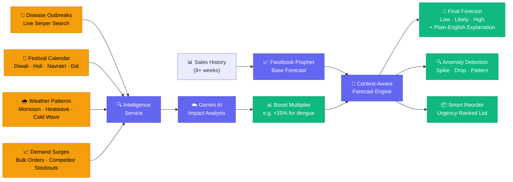
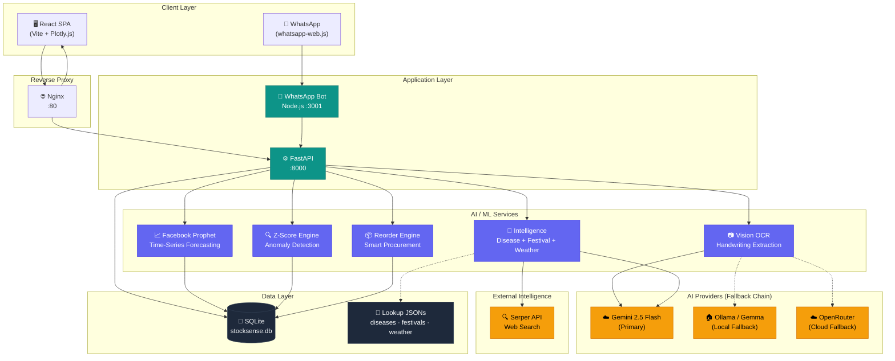
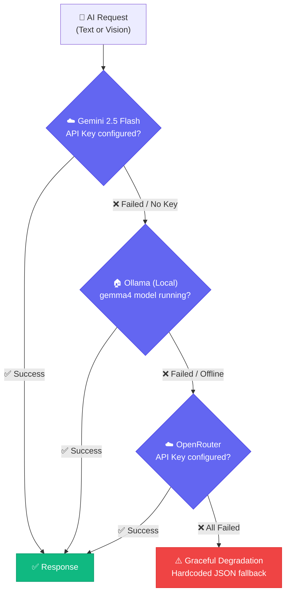
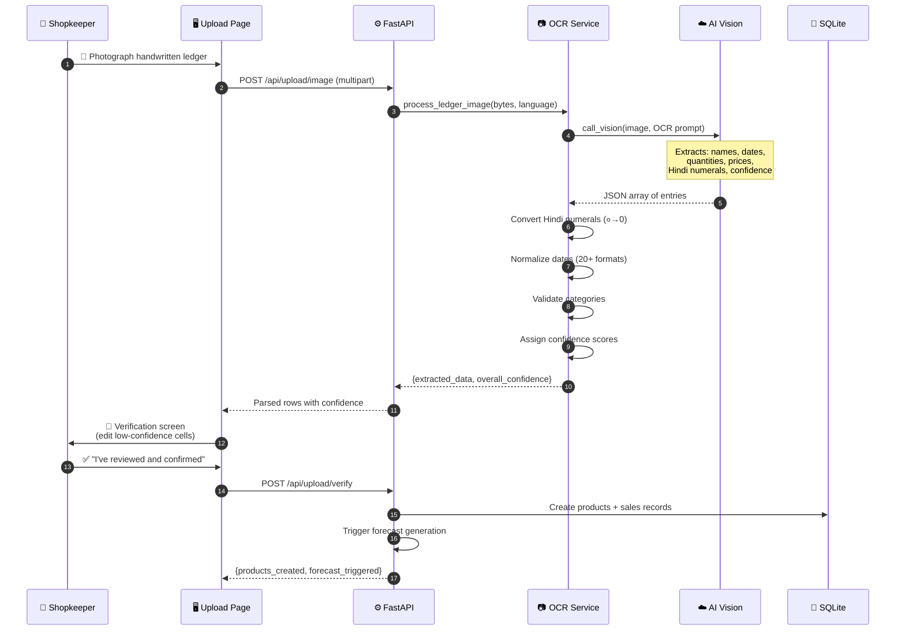

<div align="center">

# 🧠 StockSense

### AI-Powered Predictive Demand Forecasting & Intelligent Inventory Management

**The forecasting engine that knows about dengue season before your supplier does.**

[](https://natwest.com)
[](https://python.org)
[](https://react.dev)
[](https://fastapi.tiangolo.com)
[](https://facebook.github.io/prophet/)
[](https://docker.com)
[](LICENSE)

<br/>

> **StockSense doesn't just forecast demand — it understands *why* demand changes.**
> Festival season? Disease outbreak? Monsoon week? Our AI automatically detects real-world signals and adjusts your forecasts before you even notice the trend.

<br/>

[🔮 Forecasting Engine](#-the-forecasting-engine--our-core) · [⚡ Core Features](#-core-features-at-a-glance) · [📖 Ramesh's Story](#-ramesh-s-story) · [🏗️ Architecture](#️-system-architecture) · [📊 AI Pipeline](#-ai--ml-pipeline) · [🚀 Quick Start](#-quick-start)

</div>

---

## 📖 Ramesh's Story

> *Meet **Ramesh**. He runs a small pharmacy in Nagpur. Every evening, he writes the day's sales in a notebook — "Paracetamol 12, ORS 8, Cough Syrup 5." He's done this for 15 years.*
>
> *Last monsoon, dengue hit his area hard. Paracetamol sold out in 2 days. By the time he called his distributor, the entire city was scrambling for stock. He lost ₹15,000 in sales that week alone.*
>
> *This year, Ramesh uses **StockSense**.*
>
> *He photographs his notebook. AI reads his handwriting — even the Hindi numerals and messy dates. In 60 seconds, his 15 years of paper records become a digital dataset.*
>
> *Three weeks before monsoon peak, StockSense detects rising dengue reports in Nagpur via live web search. It automatically boosts Paracetamol's forecast by 25%, sends Ramesh a WhatsApp alert in Hindi:*
>
> **"⚠️ डेंगू का मौसम शुरू हो रहा है। पेरासिटामोल का स्टॉक 3 दिन में खत्म हो जाएगा। अभी 200 यूनिट ऑर्डर करें।"**
>
> *This time, Ramesh is ready. He replies "REORDER" on WhatsApp, gets a sorted procurement list grouped by supplier, and places his order — all without opening a single app.*

**That's StockSense.** From notebook → to dataset → to AI forecast → to WhatsApp alert — in the language you speak, for the reality you live.

---

## 🔮 The Forecasting Engine — Our Core

<div align="center">

**StockSense is, at its heart, a context-aware demand forecasting engine.**

*It doesn't just look at your sales history. It looks at the world around you.*

</div>

<br/>

Traditional forecasting says *"you sold 100 Paracetamol last week, so you'll probably sell 100 next week."*

**StockSense forecasting says** *"you sold 100 Paracetamol last week, BUT dengue cases are spiking in your city, Navratri is in 10 days, and monsoon rainfall is 30% above average — so you'll need **250 units** next week."*

### How Our Forecasts Stay Ahead of Reality



### Real-World Signals We Track

| Signal | Source | Impact on Forecast | Example |
|:---|:---|:---|:---|
| 🦠 **Disease Outbreaks** | Live web search (Serper API) | Auto-boost medicine categories | *"Dengue cases rising in Nagpur → Paracetamol +25%"* |
| 🎪 **Festival Seasons** | Curated calendar (30+ festivals) | Category-wide demand multiplier | *"Diwali in 2 weeks → Sweets & dry fruits +40%"* |
| 🌧️ **Monsoon / Weather** | Weather heuristics + search | Seasonal category adjustments | *"Heavy rainfall week → Umbrellas +60%, ORS +30%"* |
| 🏥 **Epidemic Alerts** | Real-time Gemini analysis | Emergency stock recommendations | *"Malaria spike in Maharashtra → Chloroquine flagged"* |
| 📈 **Demand Surges** | Z-score anomaly detection | Structural shift identification | *"3 consecutive weeks above forecast → reforecast needed"* |
| 📉 **Demand Drops** | Pattern anomaly detection | Competitive/seasonal insights | *"Sales dropped 40% → check competitor pricing"* |

> **Why this matters for the NatWest track**: Most forecasting tools treat demand as a math problem. StockSense treats it as a *real-world context problem* — incorporating live signals that actually drive demand in Indian small businesses.

---

## ⚡ Core Features at a Glance

<div align="center">

| | Feature | What It Does | Why It's Special |
|:---:|:---|:---|:---|
| 🔮 | **[Context-Aware Forecasting](#-prophet-powered-demand-forecasting)** | 6-week demand prediction with confidence bands | Incorporates festivals, diseases, weather — not just history |
| 🔍 | **[Anomaly Detection](#-z-score-anomaly-detection)** | Catches demand spikes, drops, and structural shifts | Z-score analysis with plain-English explanations |
| 📷 | **[Handwriting OCR](#-handwriting-ocr--notebook-to-database)** | Photograph notebook → instant digital dataset | Reads Hindi numerals, mixed scripts, messy dates |
| 🦠 | **[Disease Intelligence](#-real-time-disease-intelligence)** | Live outbreak tracking → auto-adjusted forecasts | 3-stage pipeline: Web Search → AI Analysis → Boost |
| 📱 | **[WhatsApp Alerts](#-whatsapp-first-interface)** | Daily briefings + 2-way commands, zero install | The interface 800M+ Indians already use daily |
| 🌍 | **[7 Indian Languages](#-multilingual-support--7-indian-languages)** | Full UI + OCR in हिंदी, தமிழ், తెలుగు, मराठी + more | Designed for shopkeepers, not Silicon Valley |
| 📦 | **[Smart Reorder](#-smart-reorder-engine)** | AI-ranked procurement lists grouped by supplier | One-tap order via WhatsApp |
| 🎯 | **[Explainable AI](#-explainable-ai--every-forecast-tells-a-story)** | Every prediction comes with a *why* | "Paracetamol +25% because dengue season is active" |

</div>

---

## ✨ Feature Deep-Dive

### 🔮 Prophet-Powered Demand Forecasting

<div align="center">

**The beating heart of StockSense.** Every feature — anomaly detection, reorder lists, WhatsApp alerts — flows from this engine.

</div>

6-week rolling demand forecasts using **Facebook Prophet** with **real-world context overlays**:

- **Confidence bands** — Low / Likely / High predictions with 80% interval width
- **External factor integration** — Festivals, disease outbreaks, monsoon patterns are *baked into the forecast*, not afterthoughts
- **Baseline comparison** — Naive "same as last period" dotted line so users can see how much smarter the forecast is
- **Sliding window training** — Retrains on the last 8 weeks, so forecasts stay fresh and responsive
- **SMA fallback** — Graceful degradation to Simple Moving Average when < 8 weeks of data
- **Scenario planning** — "What if I run a 20% discount?" / "What if my supplier delays by 5 days?"
- **Trend detection** — Automatic identification of upward/downward sales trends with percentage change

> 💡 **What makes this different**: Most forecasting tools give you `ŷ = f(history)`. StockSense gives you `ŷ = f(history, diseases, festivals, weather, anomalies)`. That's the difference between "you'll sell 100" and "you'll sell 250 because dengue season just started."

### 🔍 Z-Score Anomaly Detection

Anomalies aren't just noise — they're **signals that the world changed**. StockSense uses statistical anomaly detection on forecast residuals to catch what traditional inventory tools miss:

| Detection Type | Trigger | What It Means | User Sees |
|:---|:---|:---|:---|
| 🔺 **Spike** | Z > 2.0 | Actual demand >> predicted | *"Demand is 3× normal — possible outbreak or bulk purchase"* |
| 🔻 **Drop** | Z < -2.0 | Actual demand << predicted | *"Sales dropped 40% — check competitor pricing or supply issues"* |
| 🔄 **Pattern** | 3+ consecutive weeks, same direction | Structural demand shift | *"Consistent above-forecast for 3 weeks — reforecast recommended"* |

Every anomaly comes with:
- **Plain-language explanation** (not just a Z-score number)
- **Actionable recommendation** (restock, reforecast, investigate)
- **Automatic alert** pushed to WhatsApp if critical

### 📷 Handwriting OCR — "Notebook to Database"

<div align="center">

**StockSense's superpower for India: turning 15 years of paper notebooks into AI-ready data in 60 seconds.**

</div>

Here's what happens when a shopkeeper photographs their ledger:

1. 📸 **Upload** — Photo is sent to Gemini 2.5 Flash multimodal vision
2. 🔤 **Extraction** — AI reads product names, quantities, prices, dates — in **mixed Hindi/English** text
3. 🔢 **Hindi Numeral Conversion** — `१, २, ३` → `1, 2, 3` · number words like `बारह` → `12`
4. 📅 **Date Normalization** — Handles **20+ formats**: `12 Jan`, `12/3`, `१२-०३-२०२६`, `12 March 2026`
5. 🎯 **Confidence Scoring** — Every cell gets a confidence score (0.0–1.0); low-confidence cells are highlighted for review
6. ✅ **Verification** — Mandatory human review step before data enters the forecast pipeline — **trust layer, not blind automation**
7. 🚀 **Forecast Trigger** — Verified data automatically kicks off Prophet forecast generation

> 🔐 **Trust Layer**: No OCR-extracted data touches the forecast engine without human verification. This is a deliberate design choice — we don't sacrifice accuracy for automation.

### 🦠 Real-Time Disease Intelligence

A **3-stage intelligence pipeline** that makes StockSense forecasts context-aware:

```
Stage 1: SEARCH    → Serper API queries "dengue outbreak {user's city} {current month}"
Stage 2: ANALYZE   → Gemini 2.5 Flash analyzes search results for demand impact
Stage 3: FALLBACK  → If APIs fail, curated JSON lookup tables kick in
```

**What it covers:**

| Category | Signals Tracked | Medicines Boosted |
|:---|:---|:---|
| 🦟 **Dengue** | Jul–Nov peak, live outbreak reports | Paracetamol, ORS, Platelet supplements |
| 🦠 **Malaria** | Monsoon season, state-level alerts | Chloroquine, Artemisinin, Mosquito repellents |
| 🤧 **Monsoon Flu** | Jun–Sep, weather correlation | Cold medicine, Antibiotics, Vitamin C |
| 🥵 **Heat Waves** | Apr–Jun, temperature anomalies | ORS, Electrolytes, Sunscreen |
| ❄️ **Cold Waves** | Dec–Feb, north India | Cough syrup, Vaporub, Hot water bags |
| 🎪 **Festivals** | Diwali, Holi, Navratri, Eid, Pongal | Category-specific boosts (sweets, gifts, health) |

### 🎯 Explainable AI — Every Forecast Tells a Story

StockSense doesn't just give you numbers. **Every prediction comes with a plain-language explanation** of *why* the forecast looks the way it does:

```
📈 Paracetamol: 250 units/week (↑ 25% vs last period)
   ├── 🦟 Dengue season active in Nagpur (Jul–Nov)
   ├── 🌧️ Above-average rainfall this week
   └── 📊 Consistent upward trend for 3 weeks
```

This isn't just a UX feature — it's **what makes the forecast trustworthy**. A shopkeeper who understands *why* the AI says "order 250" is far more likely to actually act on it.

### 📦 Smart Reorder Engine

AI-calculated reorder lists **ranked by urgency**, powered by forecasts:

```
reorder_qty = (forecast_demand × lead_time_days) + safety_stock − current_stock
```

| Feature | Description |
|:---|:---|
| 🔴🟡🟢 **Urgency tiers** | High (< 3 days to stockout) · Medium (3–7 days) · Low (7+ days) |
| 🏭 **Supplier grouping** | Orders batched by supplier for efficient procurement |
| 📊 **Days-to-stockout** | Real-time countdown per product |
| 📄 **Export** | CSV and PDF download for WhatsApp/email forwarding |
| 💰 **Cost estimation** | `unit_cost × reorder_qty` for budget planning |

### 📱 WhatsApp-First Interface

**800 million Indians use WhatsApp daily.** StockSense meets them where they are — no app download, no new login, no learning curve:

| Command | What Happens |
|:---|:---|
| *(automatic, 8 AM daily)* | 📊 Morning briefing: stock health, top alerts, reorder reminders |
| `REORDER` | 📦 Full AI reorder list with quantities, suppliers, urgency tiers |
| `LIST` | 📋 Top 5 low-stock items with days-to-stockout |
| `REPORT` | 📈 Weekly performance summary with forecast accuracy |
| `STATUS` | 🔄 System health check |
| `HELP` | 📖 All available commands |

### 🌍 Multilingual Support — 7 Indian Languages

Full i18n with `react-i18next` across **all 16 screens** + OCR language adaptation:

<div align="center">

| Language | Script | Coverage |
|:---|:---|:---|
| English | English | Full UI + OCR + WhatsApp |
| हिंदी | Hindi | Full UI + OCR + WhatsApp |
| தமிழ் | Tamil | Full UI + OCR |
| తెలుగు | Telugu | Full UI + OCR |
| मराठी | Marathi | Full UI + OCR |
| বাংলা | Bengali | Full UI + OCR |
| ગુજરાતી | Gujarati | Full UI + OCR |

</div>

> 🌐 **Why this matters**: The shopkeeper in Nagpur writes in Hindi. The pharmacist in Chennai thinks in Tamil. The distributor in Ahmedabad speaks Gujarati. StockSense doesn't ask them to switch to English — it comes to them.

---

## 🏗️ System Architecture

### High-Level Design



---

## 📊 AI / ML Pipeline

### Forecast Generation Flow


### AI Provider Fallback Chain



### OCR Data Ingestion Pipeline



---

## 🛠️ Tech Stack

<div align="center">

| Layer | Technology | Purpose |
|:---|:---|:---|
| **Forecasting** | Facebook Prophet | Time-series demand prediction with confidence bands |
| **Intelligence** | Google Gemini 2.5 Flash | OCR, NLP analysis, demand factor analysis |
| **Web Search** | Serper API | Real-time disease/festival/weather signals |
| **Anomaly Detection** | NumPy (Z-score) | Statistical spike/drop/pattern detection |
| **Backend** | FastAPI (Python 3.11) | Async REST API with auto-generated docs |
| **Frontend** | React 18 + Vite + Plotly.js | Interactive forecasting dashboards |
| **WhatsApp** | whatsapp-web.js + Express | Node.js sidecar for 2-way messaging |
| **Database** | SQLAlchemy + SQLite | Zero-config with PostgreSQL-ready ORM |
| **i18n** | react-i18next | 7 Indian languages across 16 screens |
| **Deployment** | Docker Compose + Nginx | One-command full-stack launch |
| **AI Fallback** | Ollama (Gemma 4) + OpenRouter | 3-provider chain for zero-downtime AI |

</div>

---

## 🏆 Hackathon Criteria Alignment

| NatWest Criteria | StockSense Implementation |
|:---|:---|
| **AI-powered forecasting** | Prophet + external factor overlays (disease, festival, weather) |
| **Uncertainty quantification** | Confidence bands (low/likely/high) with 80% interval |
| **Anomaly detection** | Z-score analysis on forecast residuals (spike/drop/pattern) |
| **Baseline comparison** | Naive "same as last period" dotted line overlay |
| **Explainability** | Plain-language driver text: "Dengue season active (+25%)" |
| **Non-expert usability** | WhatsApp-first, 7 languages, mobile-first dark UI |
| **Real-world applicability** | Designed for 12M+ Indian small businesses |
| **Technical innovation** | Handwriting OCR + disease intelligence + WhatsApp integration |

---

## 👥 Target Users

<div align="center">

| Persona | Business | Pain Point | StockSense Solution |
|:---|:---|:---|:---|
| 🏪 **Ramesh** | Kirana Store, Mumbai | Tracks 200 SKUs in a notebook | OCR → instant digital inventory |
| 🏥 **Dr. Priya** | Pharmacy, Chennai | Misses dengue-season medicine spikes | Disease intelligence auto-boosts forecasts |
| 📦 **Vikram** | Distributor, Delhi | Manages 50+ retailer orders | WhatsApp briefings + bulk reorder exports |

</div>

---

## 📜 License

MIT License — build something great with it.

---

<div align="center">

**StockSense** — *"From notebook to forecast in 60 seconds."*

Built with ❤️ for India's 12M+ small businesses

[](https://natwest.com)

</div>
