# StockSense — UI Design Document

> **AI-Powered Inventory Management & Demand Forecasting**
> *NatWest Hackathon — AI Predictive Forecasting Track*

---

## Design System

### Brand Identity
- **Primary Color:** Teal / Emerald (`#0D9488` → `#10B981`)
- **Secondary Color:** Amber / Orange (`#F59E0B` → `#EF4444` for alerts)
- **Background:** Deep Navy / Slate (`#0F172A` → `#1E293B`)
- **Surface:** Glassmorphism cards with `rgba(255,255,255,0.05)` backgrounds
- **Typography:** Inter (Google Fonts) — clean, modern, highly legible
- **Border Radius:** 12px (cards), 8px (inputs), 24px (buttons)
- **Shadows:** Subtle glows with brand color tints

### Design Principles
| Principle | Implementation |
|---|---|
| **Mobile-first** | Every screen designed for 360px width first, scales up |
| **Minimal cognitive load** | Max 3 actions per screen, plain language |
| **Visual-first** | Charts, color-coding, icons over text tables |
| **Dark mode default** | Deep navy background with light text |
| **Accessibility** | WCAG 2.1 AA, high contrast, min 44px touch targets |

### Status Color System
| Status | Color | Usage |
|---|---|---|
| 🟢 Healthy | `#10B981` (Emerald) | Stock above reorder point |
| 🟡 Warning | `#F59E0B` (Amber) | Low stock, approaching reorder |
| 🔴 Critical | `#EF4444` (Red) | Out of stock, expired, urgent |
| 🔵 Info | `#3B82F6` (Blue) | Informational alerts, tips |

---

## Screen Inventory (16 Screens)

| # | Screen | Route | Device | Purpose |
|---|---|---|---|---|
| 1 | Landing Page | `/` | Desktop | Hero, value prop, CTAs |
| 2 | Language Selection | `/onboarding/language` | Desktop | Step 1: Choose language |
| 3 | Business Type | `/onboarding/business-type` | Desktop | Step 2: Business category |
| 4 | Shop Setup | `/onboarding/setup` | Desktop | Step 3: Shop details form |
| 5 | Data Upload | `/upload` | Desktop | CSV/Image/Manual upload |
| 6 | Data Verification | `/upload/verify` | Desktop | OCR trust layer |
| 7 | Overview Dashboard | `/dashboard/overview` | Desktop | KPIs, health summary |
| 8 | Forecasting Dashboard | `/dashboard/forecasting` | Desktop | Per-product forecasts |
| 9 | Inventory Health | `/dashboard/inventory` | Desktop | Heatmap, expiry, slow-movers |
| 10 | Scenario Planning | `/dashboard/scenarios` | Desktop | What-if simulations |
| 11 | Product Catalog | `/products` | Desktop | Product listing table |
| 12 | Product Detail | `/products/:id` | Desktop | Single product + forecast |
| 13 | Smart Reorder | `/reorder` | Desktop | AI reorder list |
| 14 | Alert Center | `/alerts` | Desktop | Active alerts feed |
| 15 | Settings | `/settings` | Desktop | Profile, notifications, WhatsApp |
| 16 | WhatsApp Chat | Mobile mockup | Mobile | Bot interaction demo |

---

## Screen Details

### 1. Landing Page (`/`)

**Purpose:** First impression — hero section with value proposition, feature highlights, how-it-works flow, and social proof.

**Key Components:**
- Hero with headline: *"From Notebook to Forecast in 60 Seconds"*
- Two CTAs: "Get Started Free" (gradient) + "Watch Demo" (outline)
- 3 feature cards: Handwriting OCR, Disease Intelligence, WhatsApp First
- 4-step "How It Works": Upload → Verify → Forecast → Act
- Persona testimonials from Ramesh, Dr. Priya, Vikram

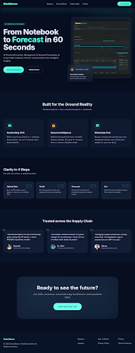

---

### 2. Onboarding — Language Selection (`/onboarding/language`)

**Purpose:** Step 1 of 3 — user selects preferred language. Supports 7 Indian languages.

**Key Components:**
- Progress indicator (Step 1 active)
- Bilingual title (Hindi + English)
- 7 language cards in grid layout with native script
- Selected card highlighted with teal border + checkmark
- Continue button

**Languages:** English, हिंदी, தமிழ், తెలుగు, मराठी, বাংলা, ગુજરાતી

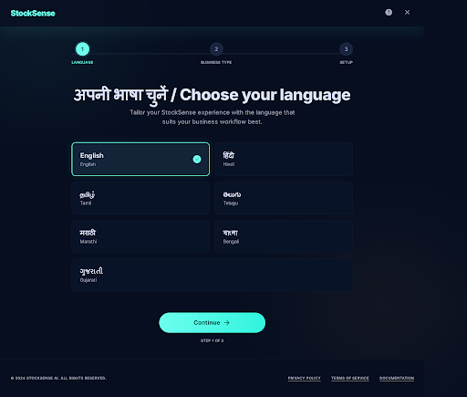

---

### 3. Onboarding — Business Type (`/onboarding/business-type`)

**Purpose:** Step 2 of 3 — determines which features are activated (e.g., Disease Intelligence for Pharmacy).

**Key Components:**
- Progress indicator (Step 2 active)
- 4 business type cards with icons and descriptions:
  - 🏥 Pharmacy (+ Disease Intelligence badge)
  - 🏪 Kirana / Grocery
  - 🏬 General Retail
  - 📦 Other
- Back and Continue buttons

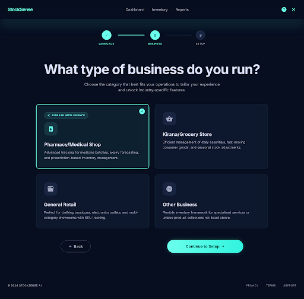

---

### 4. Onboarding — Shop Setup (`/onboarding/setup`)

**Purpose:** Step 3 of 3 — capture shop details for regional intelligence and forecasting.

**Key Components:**
- Progress indicator (Step 3 active)
- Form fields: Shop Name, City, State (dropdown), Phone (+91)
- "Complete Setup" button
- Floating label inputs with validation

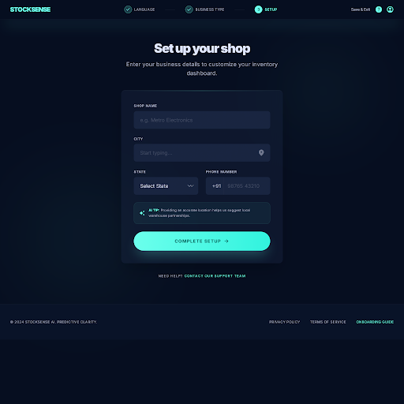

---

### 5. Data Upload (`/upload`)

**Purpose:** Accept sales data in any format — digital or handwritten.

**Key Components:**
- 3 upload method cards:
  - **CSV/Excel:** Drag-and-drop zone with file type badges
  - **Handwritten Ledger:** Image upload with AI OCR badge
  - **Manual Entry:** Form-based input option
- Recent uploads table
- Supported formats: .csv, .xlsx, .jpg, .png

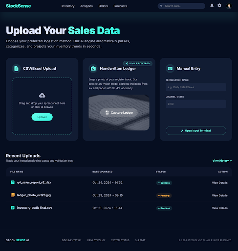

---

### 6. Data Verification (`/upload/verify`)

**Purpose:** The **trust layer** — users verify OCR-extracted data before forecasting runs. Non-negotiable step.

**Key Components:**
- Confidence score badge (e.g., "87% confidence")
- Editable data table: Product Name, Date, Quantity, Unit Price, Category
- Low-confidence cells highlighted amber with warning icons
- Checkbox: "I've reviewed and confirmed this data is accurate"
- Buttons: "Re-scan" (secondary) + "Confirm & Build Inventory" (primary)

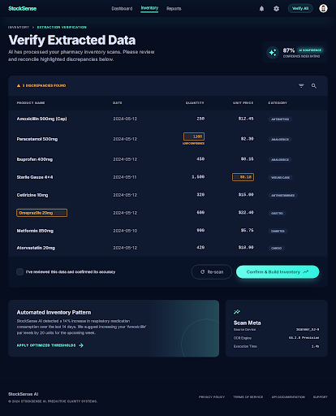

---

### 7. Overview Dashboard (`/dashboard/overview`)

**Purpose:** Headline KPIs — the "at a glance" screen. Primary daily view.

**Key Components:**
- **KPI Cards (top row):** Total SKUs, Below Reorder, Stockout Risk, Forecast Accuracy %, Inventory Value (₹)
- **Stock health donut:** Green/Amber/Red distribution
- **Alert feed:** Last 5 active alerts with severity colors
- **Quick actions:** Upload Data, View Reorder, Run Scenario
- **Stocking intelligence banner:** Combined AI recommendation with disease/festival alerts

**Navigation:** Left sidebar with all major sections

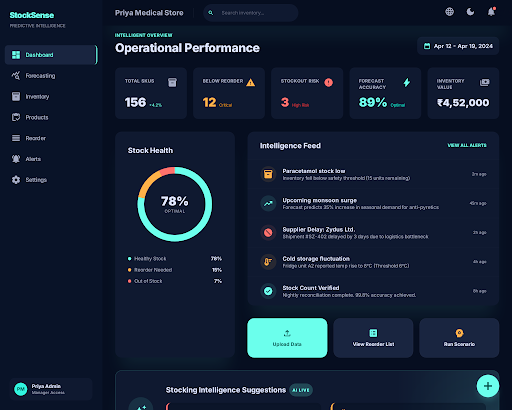

---

### 8. Forecasting Dashboard (`/dashboard/forecasting`)

**Purpose:** Per-product forecast visualization with confidence bands, baseline comparison, and explainability.

**Key Components:**
- **Product selector:** Dropdown/search
- **Forecast chart:** Line + shaded ribbon (confidence band), dotted baseline, red anomaly dots
- **Driver explanation panel:** Plain-language factors (Dengue +25%, Monsoon +10%, Trend +8%)
- **Accuracy panel:** Predicted vs Actual overlay, MAPE score
- **Scenario toggle:** "Test a Scenario" button
- **Weekly breakdown table:** Week, Low, Likely, High, Baseline

**Hackathon Criteria Covered:**
- ✅ Uncertainty ranges (confidence bands)
- ✅ Baseline comparison (naive dotted line)
- ✅ Anomaly detection (red markers)
- ✅ Non-expert explanations (driver text)

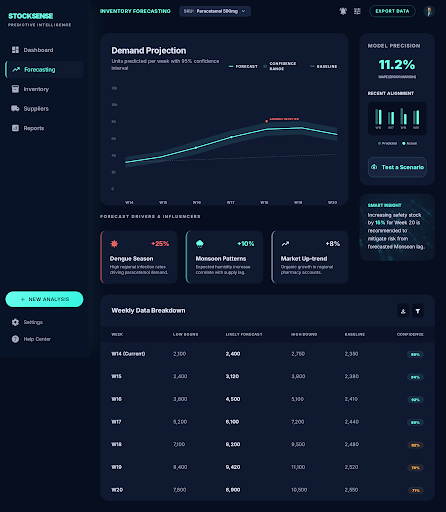

---

### 9. Inventory Health Dashboard (`/dashboard/inventory`)

**Purpose:** Identify stock problems before they cost money.

**Key Components:**
- **Stock heatmap:** Products × Days grid, color intensity = stock level
- **Days remaining bar chart:** Horizontal bars per product, red zone marker
- **Expiry timeline:** Calendar view, products expiring within 7 days flagged red
- **Slow-moving stock list:** Products with <10% sold in 30 days + clearance recommendation
- **Category breakdown:** Stock value by category bar chart

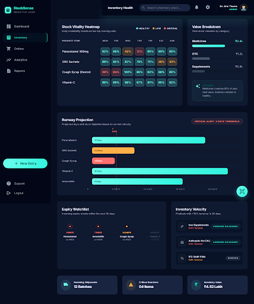

---

### 10. Scenario Planning (`/dashboard/scenarios`)

**Purpose:** What-if simulation tool for inventory decisions.

**Key Components:**
- Product and scenario type selectors (Discount, Demand Surge, Supplier Delay, Custom)
- Parameter controls (sliders/inputs for %, days, etc.)
- **Side-by-side dual charts:** "Current Forecast" vs "Scenario Forecast"
- Delta summary with impact analysis
- Apply Scenario and Reset buttons

**Scenario Types:**
| Scenario | Input | Output |
|---|---|---|
| Discount | % off | Adjusted demand forecast |
| Demand Surge | Growth % | Revised reorder quantities |
| Supplier Delay | Days delayed | Stockout risk recalculation |
| Custom | Multiplier % | Revised forecast |

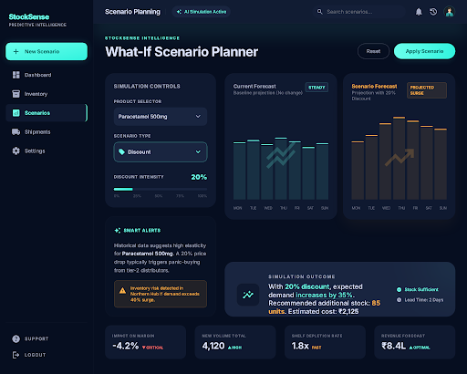

---

### 11. Product Catalog (`/products`)

**Purpose:** Full product listing with status indicators and search/filter.

**Key Components:**
- Search bar + category filter dropdown
- "Add Product" button
- Data table: Name, Category, Current Stock, Status badge, Reorder Point, Days Remaining, Supplier, Last Updated
- Status badges: Healthy (green), Low Stock (amber), Critical (red), Out of Stock (dark red)
- Pagination
- Clickable rows → Product Detail

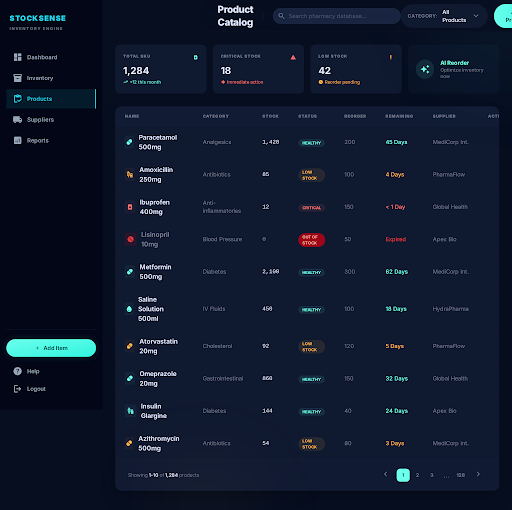

---

### 12. Product Detail (`/products/:id`)

**Purpose:** Single product deep-dive with forecast, stock history, and AI intelligence.

**Key Components:**
- Product header: Name, Category, Status badge, Stock metrics
- Product info: Supplier, Lead Time, Unit Cost, Expiry Date
- Product-specific forecast chart (6-week horizon with confidence bands)
- Stock movement history table (Sale/Restock/Adjustment entries)
- AI Intelligence sidebar: Disease alerts, reorder recommendation
- "Reorder Now" action button

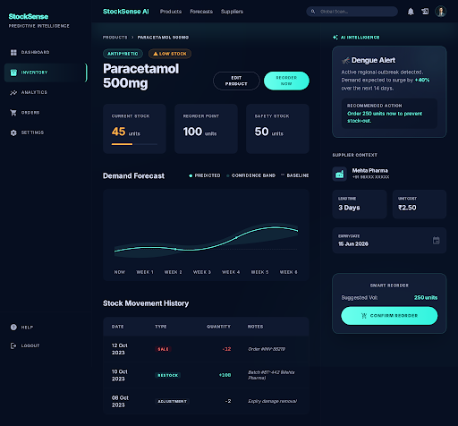

---

### 13. Smart Reorder (`/reorder`)

**Purpose:** AI-calculated reorder list grouped by supplier, ready to export.

**Key Components:**
- Summary cards: Total Items, Estimated Cost, Most Urgent
- Reorder table grouped by supplier with expandable sections
- Columns: Product, Current Stock, Forecast Demand, Reorder Qty, Urgency badge, Est. Cost
- Urgency badges: High (red), Medium (amber), Low (green)
- Export buttons: CSV + PDF
- "Send to Supplier" per group

**Reorder Formula:** `forecasted_demand × lead_time_days + safety_stock − current_stock`

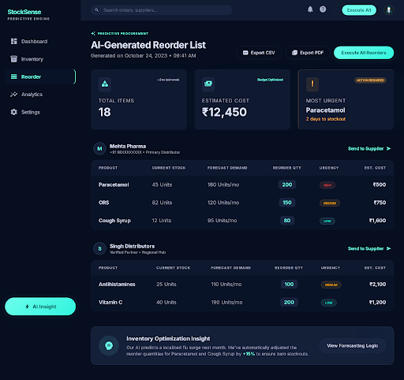

---

### 14. Alert Center (`/alerts`)

**Purpose:** Centralized alert management with severity filtering.

**Key Components:**
- Filter tabs: All, Critical, Warning, Info (with count badges)
- Alert cards with severity indicators and timestamps:
  - 🔴 Stockout alerts (immediate)
  - 🟡 Expiry warnings, demand spikes
  - 🟢 Seasonal warnings, accuracy reports
- Actions per alert: Dismiss, View Details
- Alert history section

**Alert Types:**
| Type | Trigger | Timing |
|---|---|---|
| Stockout | Stock = 0 | Immediate |
| Low Stock | Below reorder point | Immediate |
| Expiry | 7 days to expiry | Daily |
| Anomaly | Z-score breach | Immediate |
| Seasonal | 14 days before event | Advance |

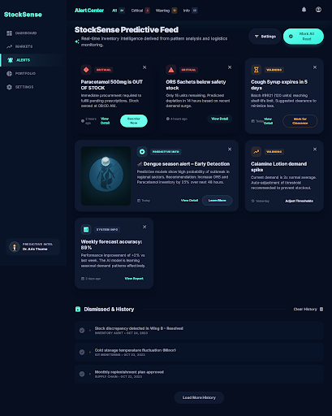

---

### 15. Settings (`/settings`)

**Purpose:** Profile management, notification preferences, WhatsApp connection.

**Key Components:**
- **Profile tab:** Shop name, business type, city, state, phone, email
- **Notifications tab:** Toggle switches for each alert type with timing controls
  - Critical stockout (always on)
  - Daily briefing (time picker)
  - Weekly summary (day picker)
  - Seasonal warnings (advance days)
  - Anomaly alerts
- **Delivery channels:** In-app, WhatsApp, Email checkboxes
- **WhatsApp Connect:** QR code scan, connection status badge

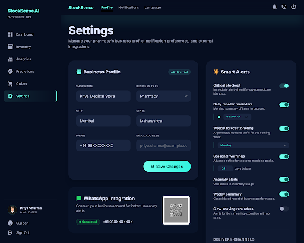

---

### 16. WhatsApp Chat (Mobile Mockup)

**Purpose:** Demonstrate WhatsApp as a primary interface — daily briefings, reorder commands, two-way interaction.

**Key Interactions Shown:**
- 🟡 Daily Briefing (8 AM): Stock health summary + intelligence + top action
- User reply: `REORDER`
- Bot response: Formatted reorder list with quantities and suppliers
- Two-way command flow demonstration

**Supported Commands:** REORDER, LIST, REPORT, FULL, STATUS, STOP, HELP

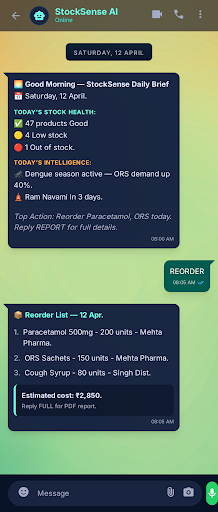

---

## User Flow Diagram

```
Landing Page
    │
    ▼
Onboarding (3 steps)
    │ Language → Business Type → Shop Setup
    │
    ▼
Data Upload
    │ CSV / Image / Manual
    │
    ▼
Data Verification (Trust Layer)
    │ Review & Confirm extracted data
    │
    ▼
┌─────────────────────────────────────────────┐
│            Main App (Sidebar Nav)            │
├─────────────┬──────────┬──────────┬─────────┤
│  Dashboard  │ Products │ Reorder  │ Alerts  │
│  ├ Overview │ ├ List   │          │         │
│  ├ Forecast │ └ Detail │          │         │
│  ├ Health   │          │          │         │
│  └ Scenario │          │          │         │
├─────────────┴──────────┴──────────┴─────────┤
│                 Settings                     │
│  Profile · Notifications · WhatsApp Connect  │
└─────────────────────────────────────────────┘
    │
    ▼ (parallel channel)
WhatsApp Bot
    Daily Briefings · Alerts · Two-way Commands
```

---

## Responsive Breakpoints

| Breakpoint | Width | Layout |
|---|---|---|
| Mobile | 360px – 767px | Single column, bottom nav, stacked cards |
| Tablet | 768px – 1023px | 2-column grid, collapsible sidebar |
| Desktop | 1024px+ | Full sidebar, multi-column dashboards |

---

## Chart Specifications

All charts use **Plotly.js** for interactivity and mobile responsiveness.

| Chart | Screen | Type | Purpose |
|---|---|---|---|
| Forecast line + ribbon | Forecasting | Line + shaded area | Confidence bands |
| Baseline dotted line | Forecasting | Dotted overlay | Naive comparison |
| Stock heatmap | Inventory | Heatmap grid | Product × time health |
| Days remaining bars | Inventory | Horizontal bar | Stock urgency |
| Health donut | Overview | Donut/pie | Green/Amber/Red split |
| Anomaly markers | Forecasting | Scatter dots | Outlier flagging |
| Dual comparison | Scenarios | Side-by-side lines | Before/after what-if |
| Category breakdown | Inventory | Bar chart | Value by category |
| Predicted vs Actual | Forecasting | Overlay lines | Accuracy tracking |

---

## Stitch Project Reference

- **Project ID:** `6258293335931284497`
- **Project URL:** [StockSense Stitch Project](https://stitch.google.com/projects/6258293335931284497)
- **Total Screens:** 16
- **Model Used:** Gemini 3.1 Pro
- **Device Types:** 15 Desktop + 1 Mobile

---

> **StockSense** — *"From notebook to forecast in 60 seconds."*
