# StockSense — HLD (Mermaid Diagrams)

> All architecture diagrams from the HLD rendered as Mermaid code.

---

## 1. System Context Diagram

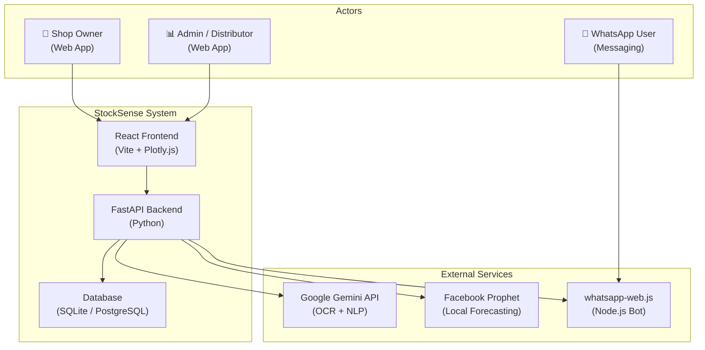

---

## 2. Logical Architecture (Layered)

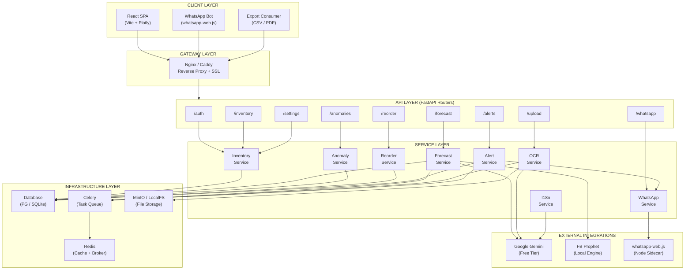

---

## 3. Data Ingestion Pipeline

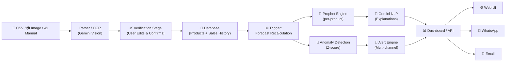

---

## 4. Forecast Generation Pipeline

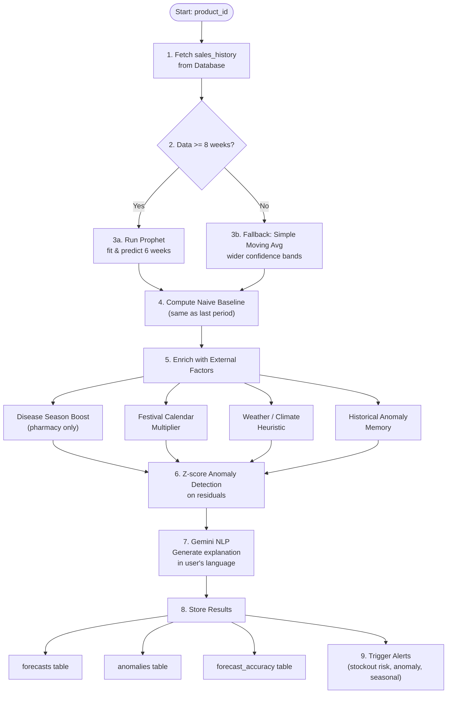

---

## 5. Entity-Relationship Diagram

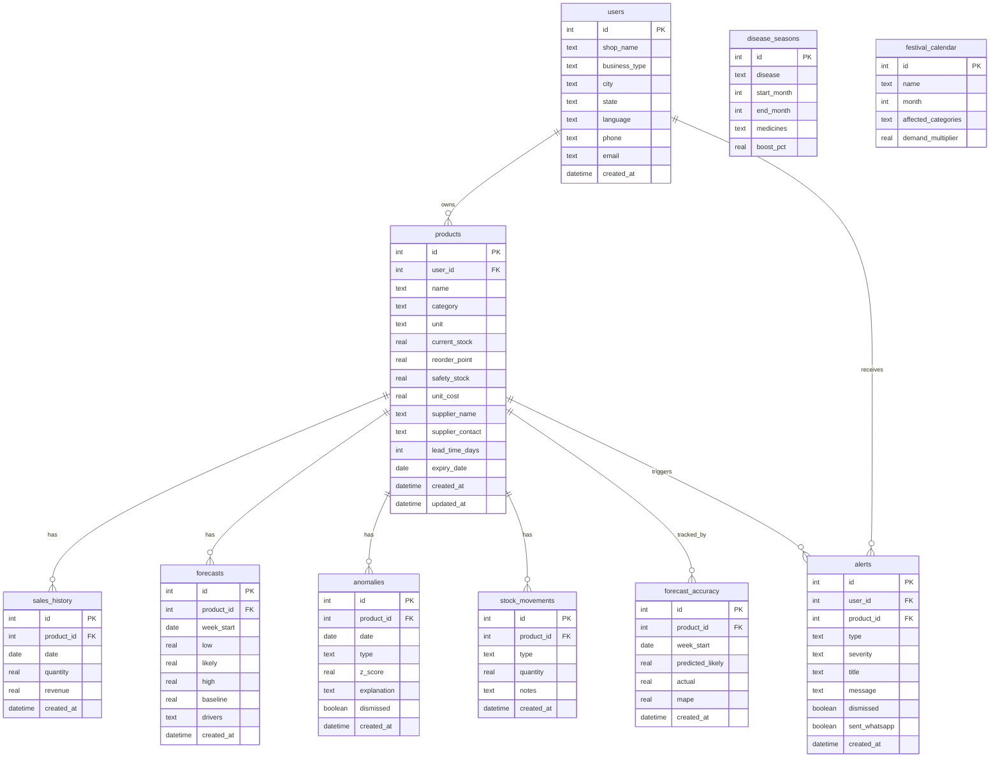

---

## 6. Horizontal Scaling Topology

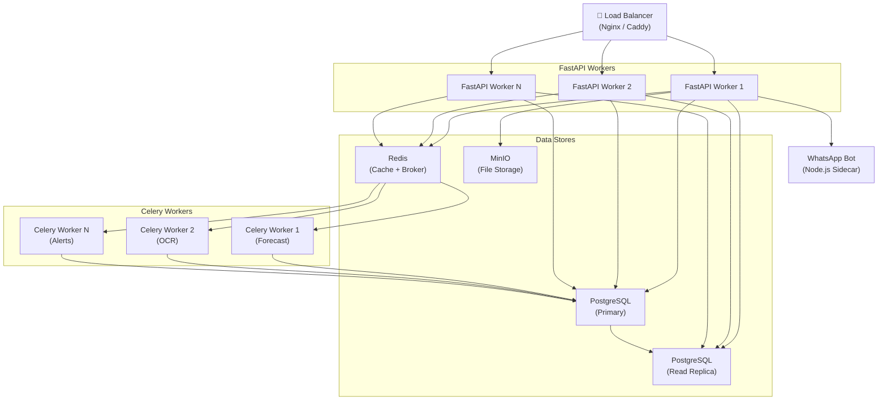

---

## 7. Background Task Architecture

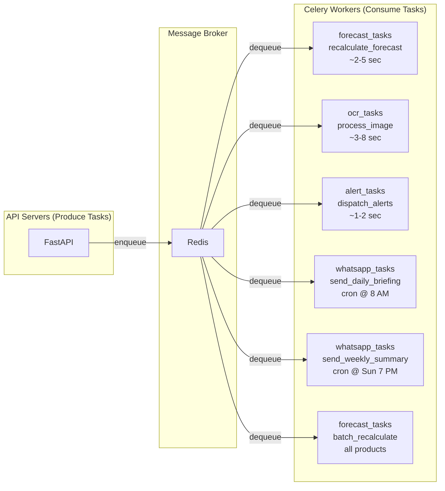

---

## 8. Caching Strategy

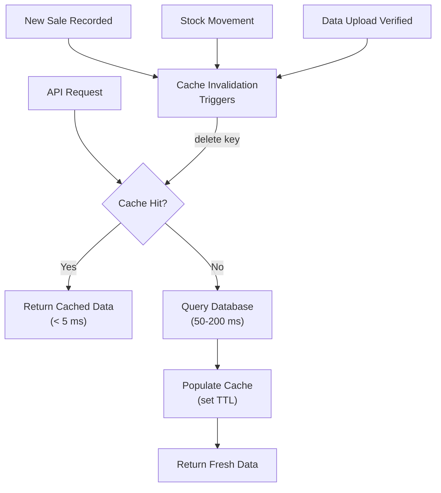

---

## 9. Gemini API Integration with Resilience

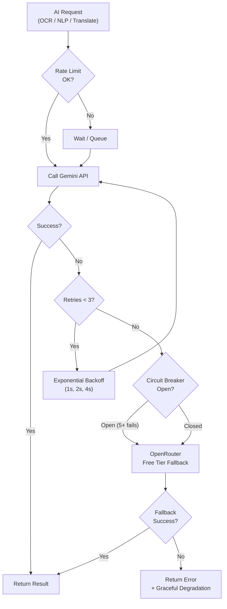

---

## 10. WhatsApp Integration Architecture

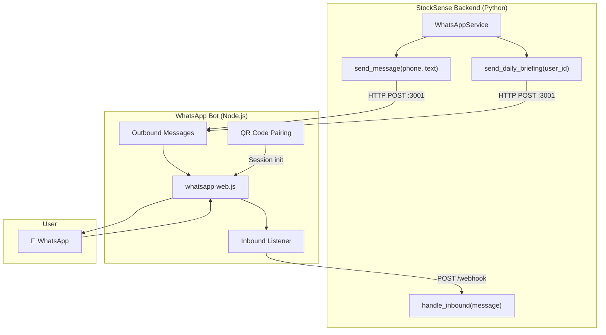

---

## 11. Deployment — Hackathon (Single Machine)

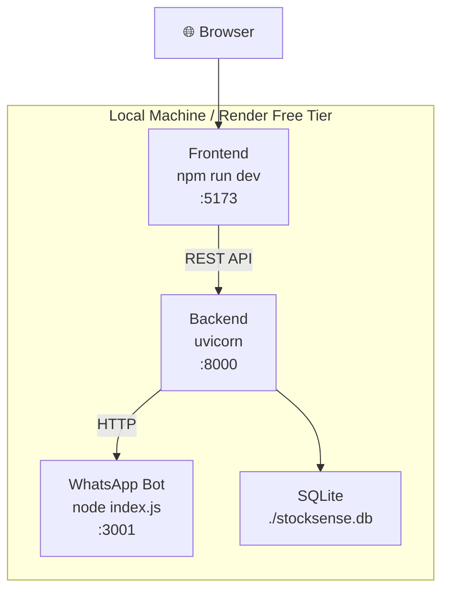

---

## 12. Deployment — Production (Containerized)

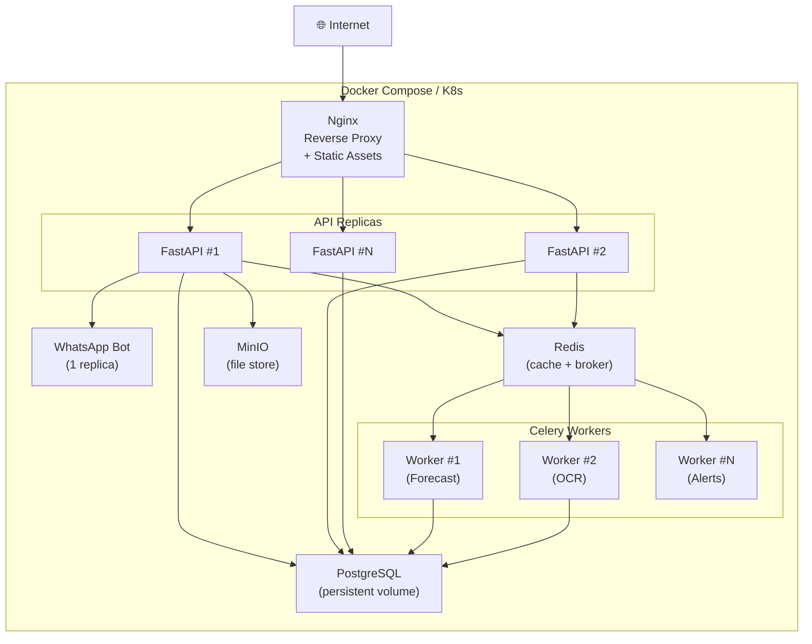

---

## 13. Technology Stack Map

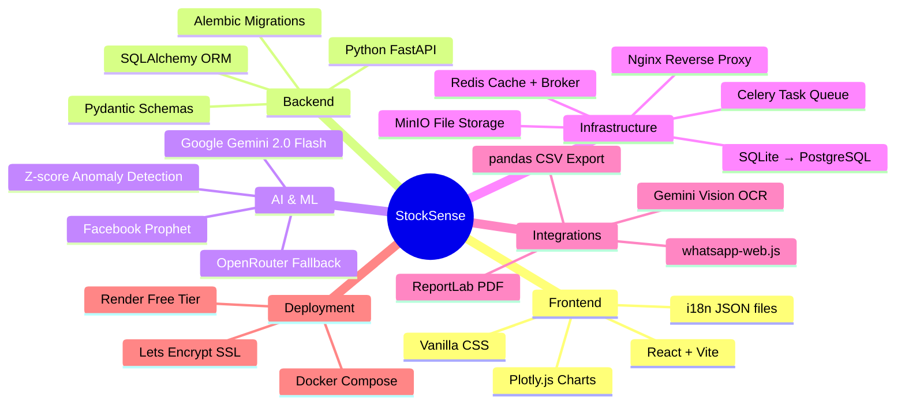

---

> **Usage:** Copy any `mermaid` code block into a Mermaid-compatible renderer (GitHub, VS Code Mermaid Preview, [mermaid.live](https://mermaid.live)) to see the rendered diagrams.
