# StockSense — Sequence Diagrams (Mermaid)

> All interaction flows rendered as Mermaid sequence diagrams.

---

## 1. User Onboarding

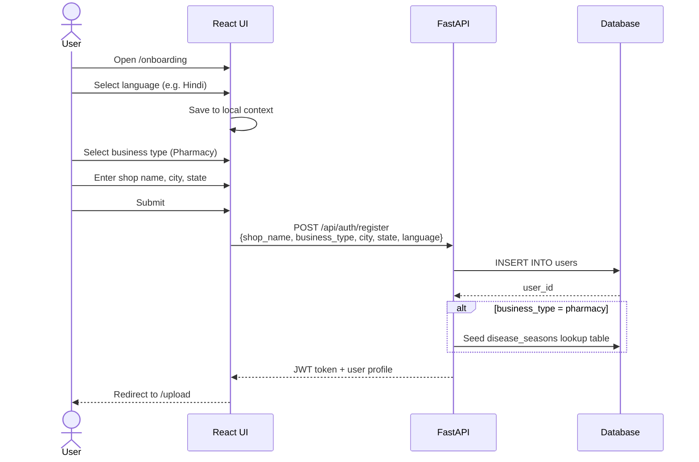
```mermaid
sequenceDiagram
    actor User
    participant UI as React UI
    participant API as FastAPI
    participant DB as Database

    User->>UI: Open /onboarding
    User->>UI: Select language (e.g. Hindi)
    UI->>UI: Save to local context

    User->>UI: Select business type (Pharmacy)
    User->>UI: Enter shop name, city, state
    User->>UI: Submit

    UI->>API: POST /api/auth/register<br/>{shop_name, business_type, city, state, language}
    API->>DB: INSERT INTO users
    DB-->>API: user_id

    alt business_type = pharmacy
        API->>DB: Seed disease_seasons lookup table
    end

    API-->>UI: JWT token + user profile
    UI-->>User: Redirect to /upload
```

---

## 2. CSV Data Upload & Verification

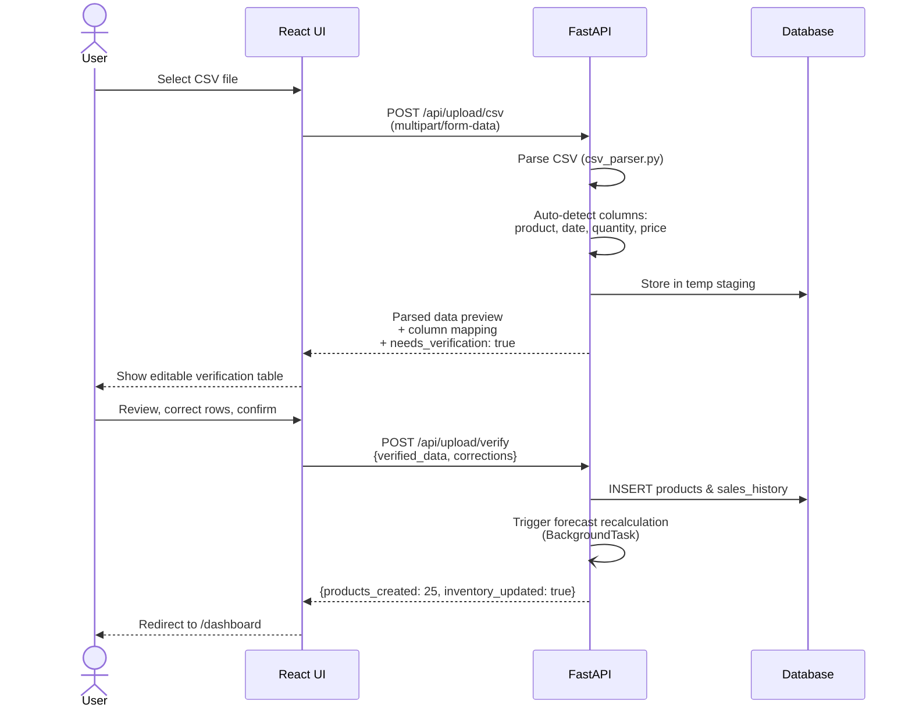
```mermaid
sequenceDiagram
    actor User
    participant UI as React UI
    participant API as FastAPI
    participant DB as Database

    User->>UI: Select CSV file
    UI->>API: POST /api/upload/csv<br/>(multipart/form-data)

    API->>API: Parse CSV (csv_parser.py)
    API->>API: Auto-detect columns:<br/>product, date, quantity, price
    API->>DB: Store in temp staging

    API-->>UI: Parsed data preview<br/>+ column mapping<br/>+ needs_verification: true

    UI-->>User: Show editable verification table
    User->>UI: Review, correct rows, confirm

    UI->>API: POST /api/upload/verify<br/>{verified_data, corrections}
    API->>DB: INSERT products & sales_history

    API-)API: Trigger forecast recalculation<br/>(BackgroundTask)

    API-->>UI: {products_created: 25, inventory_updated: true}
    UI-->>User: Redirect to /dashboard
```

---

## 3. Handwritten Ledger OCR Flow

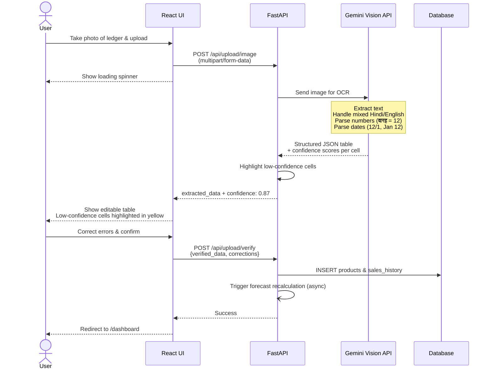
```mermaid
sequenceDiagram
    actor User
    participant UI as React UI
    participant API as FastAPI
    participant Gemini as Gemini Vision API
    participant DB as Database

    User->>UI: Take photo of ledger & upload
    UI->>API: POST /api/upload/image<br/>(multipart/form-data)
    UI-->>User: Show loading spinner

    API->>Gemini: Send image for OCR
    Note over Gemini: Extract text<br/>Handle mixed Hindi/English<br/>Parse numbers (बारह = 12)<br/>Parse dates (12/1, Jan 12)

    Gemini-->>API: Structured JSON table<br/>+ confidence scores per cell

    API->>API: Highlight low-confidence cells
    API-->>UI: extracted_data + confidence: 0.87

    UI-->>User: Show editable table<br/>Low-confidence cells highlighted in yellow

    User->>UI: Correct errors & confirm
    UI->>API: POST /api/upload/verify<br/>{verified_data, corrections}

    API->>DB: INSERT products & sales_history
    API-)API: Trigger forecast recalculation (async)

    API-->>UI: Success
    UI-->>User: Redirect to /dashboard
```

---

## 4. Forecast Generation

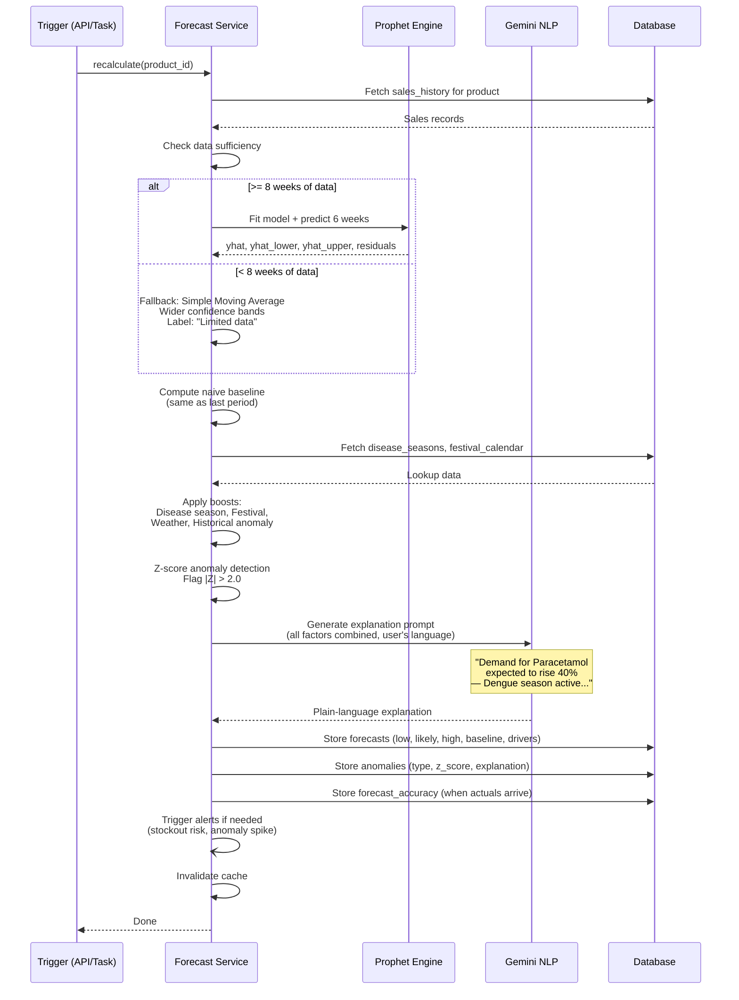
```mermaid
sequenceDiagram
    participant Trigger as Trigger (API/Task)
    participant FS as Forecast Service
    participant Prophet as Prophet Engine
    participant Gemini as Gemini NLP
    participant DB as Database

    Trigger->>FS: recalculate(product_id)

    FS->>DB: Fetch sales_history for product
    DB-->>FS: Sales records

    FS->>FS: Check data sufficiency

    alt >= 8 weeks of data
        FS->>Prophet: Fit model + predict 6 weeks
        Prophet-->>FS: yhat, yhat_lower, yhat_upper, residuals
    else < 8 weeks of data
        FS->>FS: Fallback: Simple Moving Average<br/>Wider confidence bands<br/>Label: "Limited data"
    end

    FS->>FS: Compute naive baseline<br/>(same as last period)

    FS->>DB: Fetch disease_seasons, festival_calendar
    DB-->>FS: Lookup data

    FS->>FS: Apply boosts:<br/>Disease season, Festival,<br/>Weather, Historical anomaly

    FS->>FS: Z-score anomaly detection<br/>Flag |Z| > 2.0

    FS->>Gemini: Generate explanation prompt<br/>(all factors combined, user's language)
    Note over Gemini: "Demand for Paracetamol<br/>expected to rise 40%<br/>— Dengue season active..."
    Gemini-->>FS: Plain-language explanation

    FS->>DB: Store forecasts (low, likely, high, baseline, drivers)
    FS->>DB: Store anomalies (type, z_score, explanation)
    FS->>DB: Store forecast_accuracy (when actuals arrive)

    FS-)FS: Trigger alerts if needed<br/>(stockout risk, anomaly spike)
    FS->>FS: Invalidate cache

    FS-->>Trigger: Done
```

---

## 5. Dashboard Load (Overview)

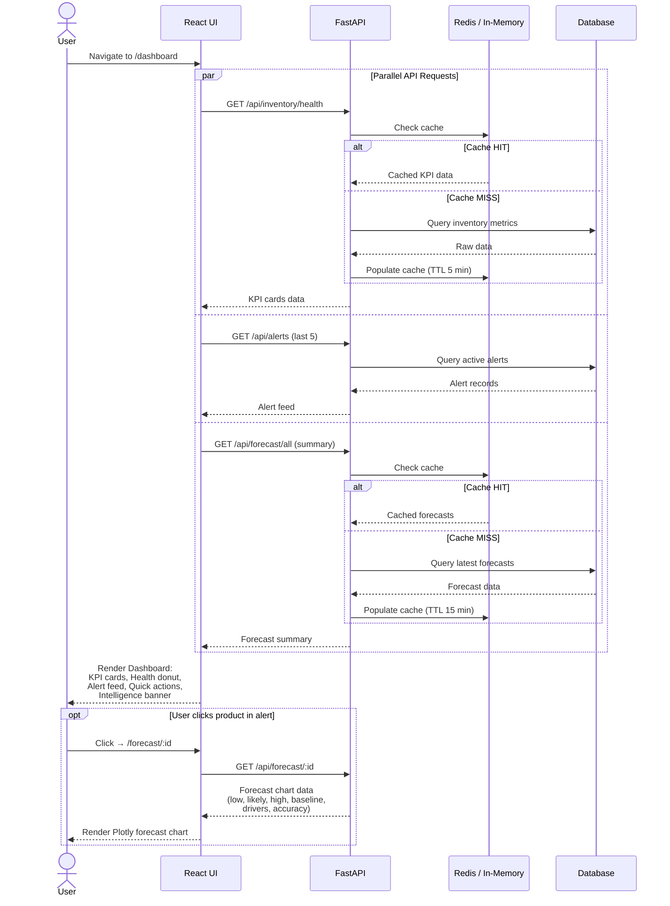
```mermaid
sequenceDiagram
    actor User
    participant UI as React UI
    participant API as FastAPI
    participant Cache as Redis / In-Memory
    participant DB as Database

    User->>UI: Navigate to /dashboard

    par Parallel API Requests
        UI->>API: GET /api/inventory/health
        API->>Cache: Check cache
        alt Cache HIT
            Cache-->>API: Cached KPI data
        else Cache MISS
            API->>DB: Query inventory metrics
            DB-->>API: Raw data
            API->>Cache: Populate cache (TTL 5 min)
        end
        API-->>UI: KPI cards data
    and
        UI->>API: GET /api/alerts (last 5)
        API->>DB: Query active alerts
        DB-->>API: Alert records
        API-->>UI: Alert feed
    and
        UI->>API: GET /api/forecast/all (summary)
        API->>Cache: Check cache
        alt Cache HIT
            Cache-->>API: Cached forecasts
        else Cache MISS
            API->>DB: Query latest forecasts
            DB-->>API: Forecast data
            API->>Cache: Populate cache (TTL 15 min)
        end
        API-->>UI: Forecast summary
    end

    UI-->>User: Render Dashboard:<br/>KPI cards, Health donut,<br/>Alert feed, Quick actions,<br/>Intelligence banner

    opt User clicks product in alert
        User->>UI: Click → /forecast/:id
        UI->>API: GET /api/forecast/:id
        API-->>UI: Forecast chart data<br/>(low, likely, high, baseline,<br/>drivers, accuracy)
        UI-->>User: Render Plotly forecast chart
    end
```

---

## 6. Anomaly Detection & Alert Dispatch

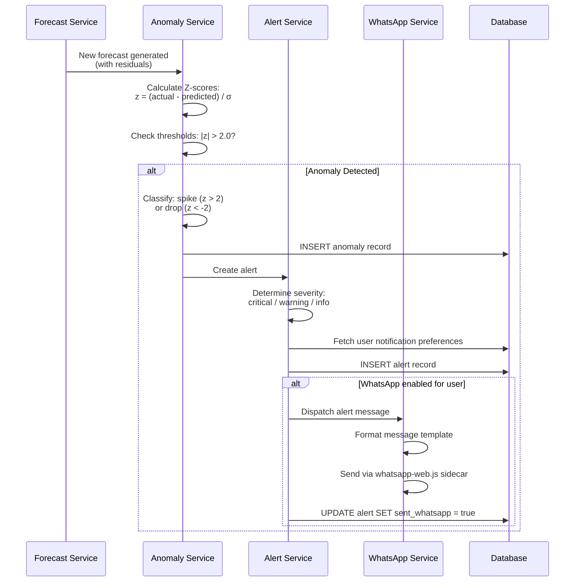
```mermaid
sequenceDiagram
    participant FS as Forecast Service
    participant AS as Anomaly Service
    participant ALS as Alert Service
    participant WA as WhatsApp Service
    participant DB as Database

    FS->>AS: New forecast generated<br/>(with residuals)

    AS->>AS: Calculate Z-scores:<br/>z = (actual - predicted) / σ

    AS->>AS: Check thresholds: |z| > 2.0?

    alt Anomaly Detected
        AS->>AS: Classify: spike (z > 2)<br/>or drop (z < -2)
        AS->>DB: INSERT anomaly record

        AS->>ALS: Create alert

        ALS->>ALS: Determine severity:<br/>critical / warning / info
        ALS->>DB: Fetch user notification preferences
        ALS->>DB: INSERT alert record

        alt WhatsApp enabled for user
            ALS->>WA: Dispatch alert message
            WA->>WA: Format message template
            WA->>WA: Send via whatsapp-web.js sidecar
            ALS->>DB: UPDATE alert SET sent_whatsapp = true
        end
    end
```

---

## 7. Scenario Planning (What-If)

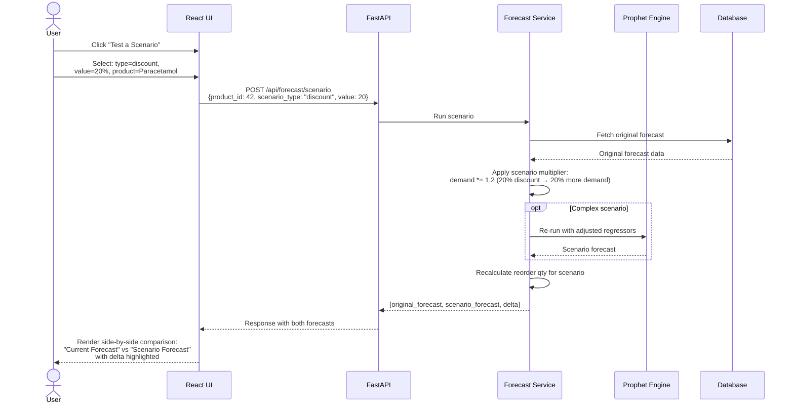
```mermaid
sequenceDiagram
    actor User
    participant UI as React UI
    participant API as FastAPI
    participant FS as Forecast Service
    participant Prophet as Prophet Engine
    participant DB as Database

    User->>UI: Click "Test a Scenario"
    User->>UI: Select: type=discount,<br/>value=20%, product=Paracetamol

    UI->>API: POST /api/forecast/scenario<br/>{product_id: 42, scenario_type: "discount", value: 20}

    API->>FS: Run scenario
    FS->>DB: Fetch original forecast
    DB-->>FS: Original forecast data

    FS->>FS: Apply scenario multiplier:<br/>demand *= 1.2 (20% discount → 20% more demand)

    opt Complex scenario
        FS->>Prophet: Re-run with adjusted regressors
        Prophet-->>FS: Scenario forecast
    end

    FS->>FS: Recalculate reorder qty for scenario

    FS-->>API: {original_forecast, scenario_forecast, delta}
    API-->>UI: Response with both forecasts

    UI-->>User: Render side-by-side comparison:<br/>"Current Forecast" vs "Scenario Forecast"<br/>with delta highlighted
```

---

## 8. Reorder List Generation & Export

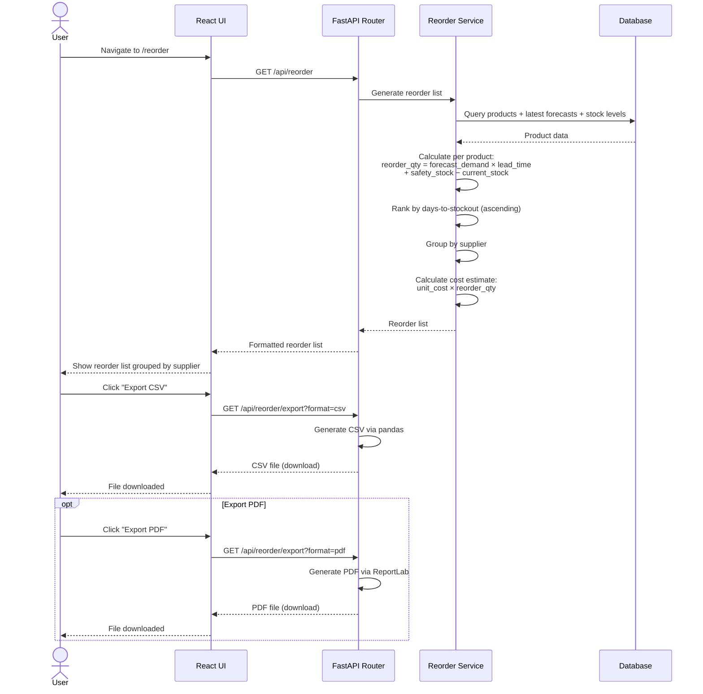
```mermaid
sequenceDiagram
    actor User
    participant UI as React UI
    participant API as FastAPI Router
    participant RS as Reorder Service
    participant DB as Database

    User->>UI: Navigate to /reorder
    UI->>API: GET /api/reorder

    API->>RS: Generate reorder list
    RS->>DB: Query products + latest forecasts + stock levels
    DB-->>RS: Product data

    RS->>RS: Calculate per product:<br/>reorder_qty = forecast_demand × lead_time<br/>+ safety_stock − current_stock

    RS->>RS: Rank by days-to-stockout (ascending)
    RS->>RS: Group by supplier
    RS->>RS: Calculate cost estimate:<br/>unit_cost × reorder_qty

    RS-->>API: Reorder list
    API-->>UI: Formatted reorder list
    UI-->>User: Show reorder list grouped by supplier

    User->>UI: Click "Export CSV"
    UI->>API: GET /api/reorder/export?format=csv
    API->>API: Generate CSV via pandas
    API-->>UI: CSV file (download)
    UI-->>User: File downloaded

    opt Export PDF
        User->>UI: Click "Export PDF"
        UI->>API: GET /api/reorder/export?format=pdf
        API->>API: Generate PDF via ReportLab
        API-->>UI: PDF file (download)
        UI-->>User: File downloaded
    end
```

---

## 9. WhatsApp Daily Briefing (Scheduled)

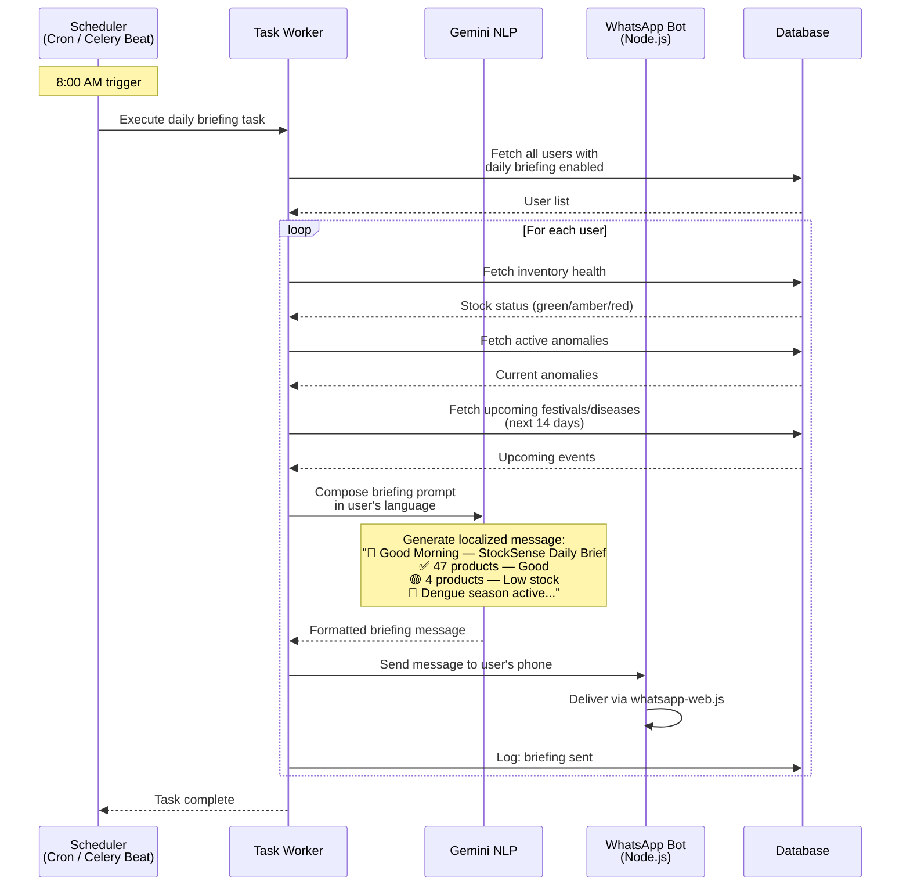
```mermaid
sequenceDiagram
    participant Cron as Scheduler<br/>(Cron / Celery Beat)
    participant Worker as Task Worker
    participant Gemini as Gemini NLP
    participant WA as WhatsApp Bot<br/>(Node.js)
    participant DB as Database

    Note over Cron: 8:00 AM trigger
    Cron->>Worker: Execute daily briefing task

    Worker->>DB: Fetch all users with<br/>daily briefing enabled
    DB-->>Worker: User list

    loop For each user
        Worker->>DB: Fetch inventory health
        DB-->>Worker: Stock status (green/amber/red)

        Worker->>DB: Fetch active anomalies
        DB-->>Worker: Current anomalies

        Worker->>DB: Fetch upcoming festivals/diseases<br/>(next 14 days)
        DB-->>Worker: Upcoming events

        Worker->>Gemini: Compose briefing prompt<br/>in user's language
        Note over Gemini: Generate localized message:<br/>"🌅 Good Morning — StockSense Daily Brief<br/>✅ 47 products — Good<br/>🟡 4 products — Low stock<br/>🦟 Dengue season active..."
        Gemini-->>Worker: Formatted briefing message

        Worker->>WA: Send message to user's phone
        WA->>WA: Deliver via whatsapp-web.js

        Worker->>DB: Log: briefing sent
    end

    Worker-->>Cron: Task complete
```

---

## 10. WhatsApp Inbound Command

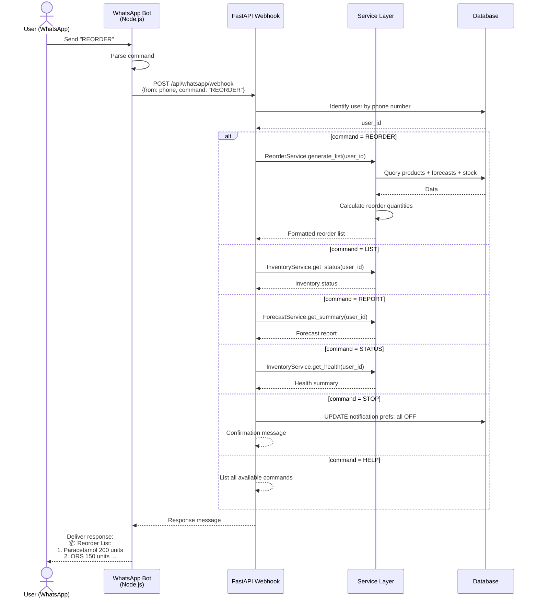
```mermaid
sequenceDiagram
    actor User as User (WhatsApp)
    participant WA as WhatsApp Bot<br/>(Node.js)
    participant API as FastAPI Webhook
    participant SVC as Service Layer
    participant DB as Database

    User->>WA: Send "REORDER"
    WA->>WA: Parse command

    WA->>API: POST /api/whatsapp/webhook<br/>{from: phone, command: "REORDER"}

    API->>DB: Identify user by phone number
    DB-->>API: user_id

    alt command = REORDER
        API->>SVC: ReorderService.generate_list(user_id)
        SVC->>DB: Query products + forecasts + stock
        DB-->>SVC: Data
        SVC->>SVC: Calculate reorder quantities
        SVC-->>API: Formatted reorder list
    else command = LIST
        API->>SVC: InventoryService.get_status(user_id)
        SVC-->>API: Inventory status
    else command = REPORT
        API->>SVC: ForecastService.get_summary(user_id)
        SVC-->>API: Forecast report
    else command = STATUS
        API->>SVC: InventoryService.get_health(user_id)
        SVC-->>API: Health summary
    else command = STOP
        API->>DB: UPDATE notification prefs: all OFF
        API-->>API: Confirmation message
    else command = HELP
        API-->>API: List all available commands
    end

    API-->>WA: Response message
    WA-->>User: Deliver response:<br/>📦 Reorder List:<br/>1. Paracetamol 200 units<br/>2. ORS 150 units ...
```

---

## 11. Stock Movement Update

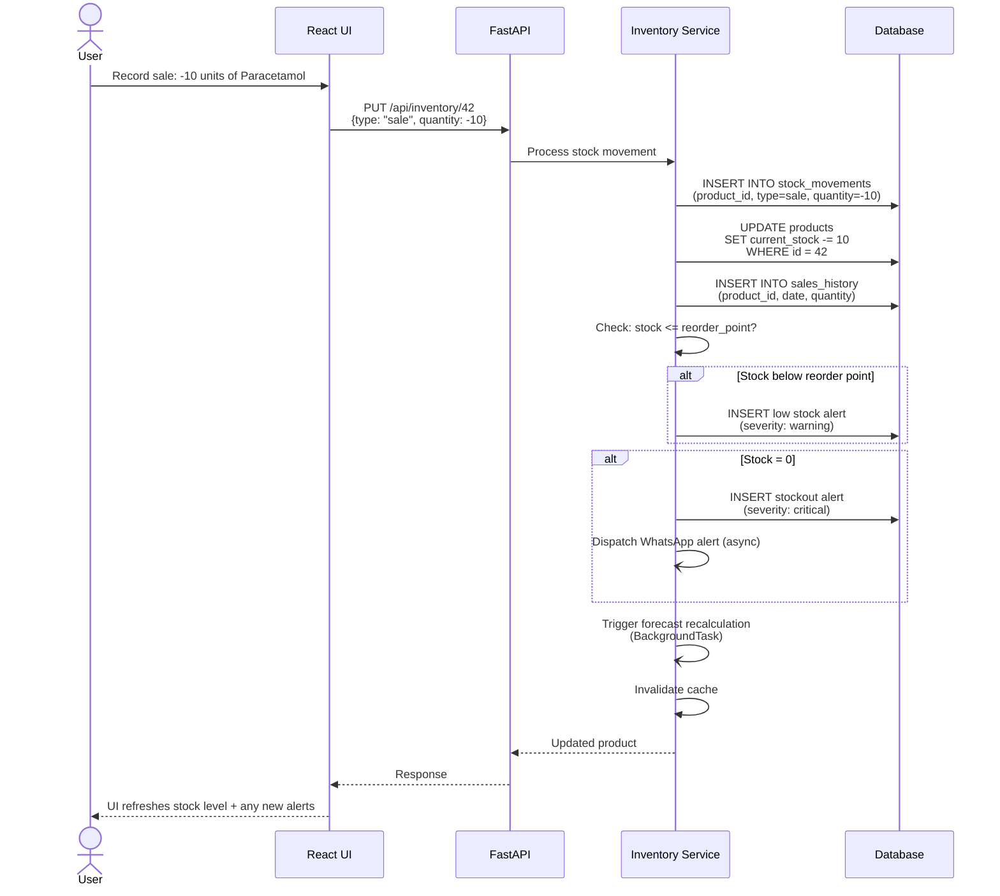
```mermaid
sequenceDiagram
    actor User
    participant UI as React UI
    participant API as FastAPI
    participant IS as Inventory Service
    participant DB as Database

    User->>UI: Record sale: -10 units of Paracetamol

    UI->>API: PUT /api/inventory/42<br/>{type: "sale", quantity: -10}
    API->>IS: Process stock movement

    IS->>DB: INSERT INTO stock_movements<br/>(product_id, type=sale, quantity=-10)

    IS->>DB: UPDATE products<br/>SET current_stock -= 10<br/>WHERE id = 42

    IS->>DB: INSERT INTO sales_history<br/>(product_id, date, quantity)

    IS->>IS: Check: stock <= reorder_point?

    alt Stock below reorder point
        IS->>DB: INSERT low stock alert<br/>(severity: warning)
    end

    alt Stock = 0
        IS->>DB: INSERT stockout alert<br/>(severity: critical)
        IS-)IS: Dispatch WhatsApp alert (async)
    end

    IS-)IS: Trigger forecast recalculation<br/>(BackgroundTask)
    IS->>IS: Invalidate cache

    IS-->>API: Updated product
    API-->>UI: Response
    UI-->>User: UI refreshes stock level + any new alerts
```

---

## 12. Forecast Accuracy Tracking

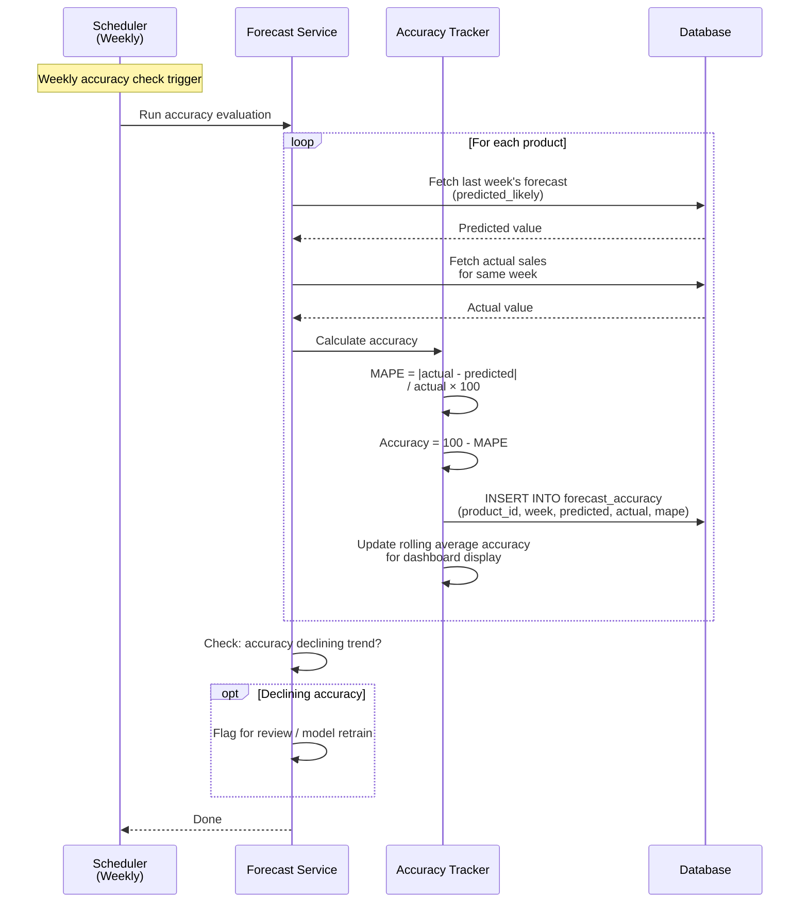
```mermaid
sequenceDiagram
    participant Cron as Scheduler<br/>(Weekly)
    participant FS as Forecast Service
    participant AT as Accuracy Tracker
    participant DB as Database

    Note over Cron: Weekly accuracy check trigger
    Cron->>FS: Run accuracy evaluation

    loop For each product
        FS->>DB: Fetch last week's forecast<br/>(predicted_likely)
        DB-->>FS: Predicted value

        FS->>DB: Fetch actual sales<br/>for same week
        DB-->>FS: Actual value

        FS->>AT: Calculate accuracy

        AT->>AT: MAPE = |actual - predicted|<br/>/ actual × 100
        AT->>AT: Accuracy = 100 - MAPE

        AT->>DB: INSERT INTO forecast_accuracy<br/>(product_id, week, predicted, actual, mape)

        AT->>AT: Update rolling average accuracy<br/>for dashboard display
    end

    FS->>FS: Check: accuracy declining trend?

    opt Declining accuracy
        FS->>FS: Flag for review / model retrain
    end

    FS-->>Cron: Done
```

---

## 13. Complete Request-Response Flow (API Call with Caching)

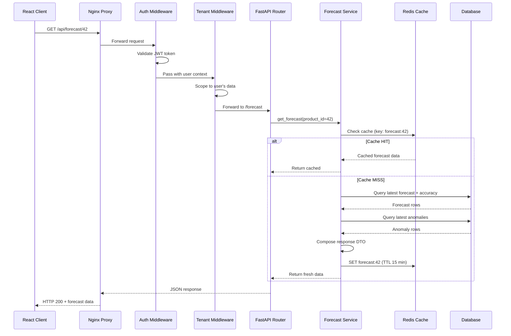
```mermaid
sequenceDiagram
    participant Client as React Client
    participant Nginx as Nginx Proxy
    participant Auth as Auth Middleware
    participant Tenant as Tenant Middleware
    participant Router as FastAPI Router
    participant SVC as Forecast Service
    participant Cache as Redis Cache
    participant DB as Database

    Client->>Nginx: GET /api/forecast/42
    Nginx->>Auth: Forward request

    Auth->>Auth: Validate JWT token
    Auth->>Tenant: Pass with user context

    Tenant->>Tenant: Scope to user's data
    Tenant->>Router: Forward to /forecast

    Router->>SVC: get_forecast(product_id=42)

    SVC->>Cache: Check cache (key: forecast:42)

    alt Cache HIT
        Cache-->>SVC: Cached forecast data
        SVC-->>Router: Return cached
    else Cache MISS
        SVC->>DB: Query latest forecast + accuracy
        DB-->>SVC: Forecast rows
        SVC->>DB: Query latest anomalies
        DB-->>SVC: Anomaly rows
        SVC->>SVC: Compose response DTO
        SVC->>Cache: SET forecast:42 (TTL 15 min)
        SVC-->>Router: Return fresh data
    end

    Router-->>Nginx: JSON response
    Nginx-->>Client: HTTP 200 + forecast data
```

---

## 14. End-to-End: First-Time User Journey

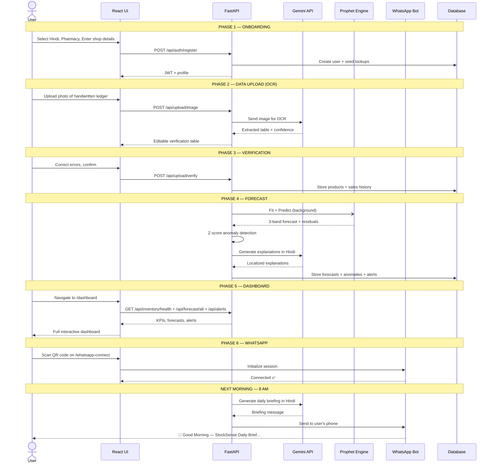
```mermaid
sequenceDiagram
    actor User
    participant UI as React UI
    participant API as FastAPI
    participant Gemini as Gemini API
    participant Prophet as Prophet Engine
    participant WA as WhatsApp Bot
    participant DB as Database

    Note over User,DB: PHASE 1 — ONBOARDING
    User->>UI: Select Hindi, Pharmacy, Enter shop details
    UI->>API: POST /api/auth/register
    API->>DB: Create user + seed lookups
    API-->>UI: JWT + profile

    Note over User,DB: PHASE 2 — DATA UPLOAD (OCR)
    User->>UI: Upload photo of handwritten ledger
    UI->>API: POST /api/upload/image
    API->>Gemini: Send image for OCR
    Gemini-->>API: Extracted table + confidence
    API-->>UI: Editable verification table

    Note over User,DB: PHASE 3 — VERIFICATION
    User->>UI: Correct errors, confirm
    UI->>API: POST /api/upload/verify
    API->>DB: Store products + sales history

    Note over User,DB: PHASE 4 — FORECAST
    API-)Prophet: Fit + Predict (background)
    Prophet-->>API: 3-band forecast + residuals
    API->>API: Z-score anomaly detection
    API->>Gemini: Generate explanations in Hindi
    Gemini-->>API: Localized explanations
    API->>DB: Store forecasts + anomalies + alerts

    Note over User,DB: PHASE 5 — DASHBOARD
    User->>UI: Navigate to /dashboard
    UI->>API: GET /api/inventory/health + /api/forecast/all + /api/alerts
    API-->>UI: KPIs, forecasts, alerts
    UI-->>User: Full interactive dashboard

    Note over User,DB: PHASE 6 — WHATSAPP
    User->>UI: Scan QR code on /whatsapp-connect
    UI->>WA: Initialize session
    WA-->>UI: Connected ✅

    Note over User,DB: NEXT MORNING — 8 AM
    API->>Gemini: Generate daily briefing in Hindi
    Gemini-->>API: Briefing message
    API->>WA: Send to user's phone
    WA-->>User: 🌅 Good Morning — StockSense Daily Brief...
```

---

> **Usage:** Copy any `mermaid` code block into:
> - **GitHub**: Renders natively in `.md` files
> - **VS Code**: Install "Mermaid Preview" extension
> - **Online**: Paste at [mermaid.live](https://mermaid.live)
> - **Notion**: Use `/mermaid` block
